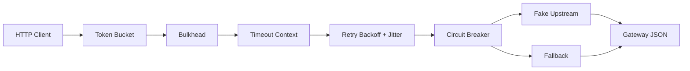

# Chapter 15 Resilience Perf Implementation Plan

> **For agentic workers:** REQUIRED SUB-SKILL: Use superpowers:subagent-driven-development (recommended) or superpowers:executing-plans to implement this plan task-by-task. Steps use checkbox (`- [ ]`) syntax for tracking.

**Goal:** Build a runnable, self-contained Chapter 15 that teaches resilience and performance patterns through a product-details Gateway with limiters, bulkheads, retry/backoff, circuit breaking, fallback, pprof, and production-solution comparisons.

**Architecture:** Chapter 15 lives under `stage-3-architecture/15-resilience-perf/` and reuses the product/stock learning domain without modifying Chapter 14 code. A controllable HTTP upstream feeds a standard-library HTTP Gateway; small focused packages own limiter, retry, bulkhead, breaker, profiler, and error mapping concerns.

**Tech Stack:** Go 1.24, standard library `net/http`, `httptest`, `context`, `net/http/pprof`, `github.com/sony/gobreaker/v2 v2.4.0`, Go standard testing, OpenSpec artifacts.

## Global Constraints

- Keep the repository module declaration at Go 1.24; do not select dependencies that require Go 1.25.
- Default Chapter 15 execution and tests require no Docker, Redis, Envoy, service mesh, vegeta, wrk, hey, or external upstream service.
- Add only `github.com/sony/gobreaker/v2 v2.4.0` as the new runtime dependency unless implementation proves an existing transitive dependency is already sufficient.
- Token bucket, retry/backoff, jitter, fake upstream, fallback, and bulkhead are teaching implementations, not production recommendations.
- README must explicitly list production-grade alternatives: `golang.org/x/time/rate`, `sony/gobreaker`, `hashicorp/go-retryablehttp`, `cenkalti/backoff`, failsafe-go, Envoy, Kong, APISIX, Nginx/OpenResty, Istio, Linkerd, Consul Connect, Redis/GCRA, Sentinel, Prometheus/Grafana, pprof, go tool trace, Pyroscope/Parca, vegeta, wrk, hey, k6, and JMeter.
- All tests must be deterministic and avoid machine-dependent fixed QPS, latency, or allocation assertions.
- Request-level context controls timeout and cancellation; no package stores request context globally.
- Learner-facing prose is simplified Chinese; identifiers, protocols, package names, and shell commands retain standard English names.
- Preserve unrelated user changes: current `.gitignore` modifications and untracked `.agents/` are not part of this chapter unless the user explicitly says otherwise.
- Do not actually create commits unless the user explicitly authorizes committing; commit steps below are handoff markers for workers with commit authorization.

---

## Planned File Structure

- `openspec/changes/chapter-15-resilience-perf/.openspec.yaml`: OpenSpec change metadata.
- `openspec/changes/chapter-15-resilience-perf/proposal.md`: why/what/impact for Chapter 15.
- `openspec/changes/chapter-15-resilience-perf/design.md`: concise OpenSpec design summary matching the approved Superpowers spec.
- `openspec/changes/chapter-15-resilience-perf/tasks.md`: implementation checklist updated during execution.
- `stage-3-architecture/15-resilience-perf/internal/upstream/types.go`: product DTO, upstream error type, retry classification helpers.
- `stage-3-architecture/15-resilience-perf/internal/upstream/client.go`: HTTP product client.
- `stage-3-architecture/15-resilience-perf/internal/upstream/fake.go`: deterministic scripted fake upstream handler.
- `stage-3-architecture/15-resilience-perf/internal/limiter/clock.go`: clock abstraction plus real clock.
- `stage-3-architecture/15-resilience-perf/internal/limiter/token_bucket.go`: teaching token bucket.
- `stage-3-architecture/15-resilience-perf/internal/bulkhead/bulkhead.go`: semaphore bulkhead.
- `stage-3-architecture/15-resilience-perf/internal/retry/retry.go`: generic retry loop with exponential backoff and injectable sleeper/jitter.
- `stage-3-architecture/15-resilience-perf/internal/breaker/breaker.go`: `gobreaker/v2` wrapper.
- `stage-3-architecture/15-resilience-perf/internal/gateway/handler.go`: HTTP Gateway and strategy orchestration.
- `stage-3-architecture/15-resilience-perf/internal/gateway/errors.go`: stable response and error mapping helpers.
- `stage-3-architecture/15-resilience-perf/internal/profiler/profiler.go`: pprof registration and demo heap workload.
- `stage-3-architecture/15-resilience-perf/app.go`: demo composition using `httptest` servers.
- `stage-3-architecture/15-resilience-perf/main.go`: executable entry point.
- Matching `_test.go` files beside each package.
- `stage-3-architecture/15-resilience-perf/README.md`: Chinese chapter guide, commands, pprof and production alternatives.
- `stage-3-architecture/15-resilience-perf/EXERCISES.md`: measurable extension exercises.
- `ROADMAP.md`: Chapter 15 output and completion checkbox.
- `go.mod` and `go.sum`: add `github.com/sony/gobreaker/v2 v2.4.0`.

### Task 1: OpenSpec Tracking and Upstream Contract

**Files:**
- Create: `openspec/changes/chapter-15-resilience-perf/.openspec.yaml`
- Create: `openspec/changes/chapter-15-resilience-perf/proposal.md`
- Create: `openspec/changes/chapter-15-resilience-perf/design.md`
- Create: `openspec/changes/chapter-15-resilience-perf/tasks.md`
- Create: `stage-3-architecture/15-resilience-perf/internal/upstream/types.go`
- Create: `stage-3-architecture/15-resilience-perf/internal/upstream/client.go`
- Create: `stage-3-architecture/15-resilience-perf/internal/upstream/fake.go`
- Test: `stage-3-architecture/15-resilience-perf/internal/upstream/client_test.go`

**Interfaces:**
- Produces: `type Product struct { SKU string; Name string; PriceCents int64; Quantity int64; Degraded bool; DegradeReason string }`.
- Produces: `type Client interface { GetProduct(context.Context, string) (Product, error) }`.
- Produces: `type Error struct { StatusCode int; Temporary bool; Message string }` with `Error() string`.
- Produces: `func IsRetryable(error) bool`, `func IsClientError(error) bool`, and `func IsNotFound(error) bool`.
- Produces: `func NewHTTPClient(baseURL string, client *http.Client) *HTTPClient`.
- Produces: `type ScriptedHandler` with `func NewScriptedHandler(responses []ScriptedResponse) *ScriptedHandler` and `func (h *ScriptedHandler) Calls() int`.

- [ ] **Step 1: Write the failing upstream tests**

Create `stage-3-architecture/15-resilience-perf/internal/upstream/client_test.go` with these tests:

```go
package upstream

import (
    "context"
    "errors"
    "net/http"
    "net/http/httptest"
    "testing"
    "time"
)

func TestHTTPClientSuccess(t *testing.T) {
    srv := httptest.NewServer(NewScriptedHandler([]ScriptedResponse{{
        StatusCode: http.StatusOK,
        Product: Product{SKU: "book-1", Name: "Go Microservices", PriceCents: 9900, Quantity: 7},
    }}))
    defer srv.Close()

    client := NewHTTPClient(srv.URL, srv.Client())
    got, err := client.GetProduct(context.Background(), "book-1")
    if err != nil {
        t.Fatalf("GetProduct returned error: %v", err)
    }
    if got.SKU != "book-1" || got.Name != "Go Microservices" || got.PriceCents != 9900 || got.Quantity != 7 {
        t.Fatalf("unexpected product: %#v", got)
    }
}

func TestHTTPClientMapsServerErrorAsRetryable(t *testing.T) {
    srv := httptest.NewServer(NewScriptedHandler([]ScriptedResponse{{
        StatusCode: http.StatusServiceUnavailable,
        Body:       `{"error":"temporarily unavailable"}`,
    }}))
    defer srv.Close()

    client := NewHTTPClient(srv.URL, srv.Client())
    _, err := client.GetProduct(context.Background(), "book-1")
    if err == nil {
        t.Fatal("expected error")
    }
    if !IsRetryable(err) {
        t.Fatalf("expected retryable error, got %T %v", err, err)
    }
    var upstreamErr Error
    if !errors.As(err, &upstreamErr) {
        t.Fatalf("expected upstream Error, got %T", err)
    }
    if upstreamErr.StatusCode != http.StatusServiceUnavailable {
        t.Fatalf("status = %d", upstreamErr.StatusCode)
    }
}

func TestHTTPClientDoesNotRetryClientErrors(t *testing.T) {
    srv := httptest.NewServer(NewScriptedHandler([]ScriptedResponse{{
        StatusCode: http.StatusNotFound,
        Body:       `{"error":"missing"}`,
    }}))
    defer srv.Close()

    client := NewHTTPClient(srv.URL, srv.Client())
    _, err := client.GetProduct(context.Background(), "missing")
    if err == nil {
        t.Fatal("expected error")
    }
    if IsRetryable(err) {
        t.Fatalf("not-found error must not be retryable: %v", err)
    }
    if !IsNotFound(err) {
        t.Fatalf("expected not-found classification: %v", err)
    }
}

func TestScriptedHandlerUsesLastResponseAfterScriptIsExhausted(t *testing.T) {
    handler := NewScriptedHandler([]ScriptedResponse{{
        StatusCode: http.StatusServiceUnavailable,
        Body:       `{"error":"first"}`,
    }, {
        StatusCode: http.StatusOK,
        Product:    Product{SKU: "book-1", Name: "Recovered", PriceCents: 1, Quantity: 2},
    }})
    srv := httptest.NewServer(handler)
    defer srv.Close()

    client := NewHTTPClient(srv.URL, srv.Client())
    _, _ = client.GetProduct(context.Background(), "book-1")
    _, err := client.GetProduct(context.Background(), "book-1")
    if err != nil {
        t.Fatalf("second call should recover: %v", err)
    }
    _, err = client.GetProduct(context.Background(), "book-1")
    if err != nil {
        t.Fatalf("third call should reuse final response: %v", err)
    }
    if got := handler.Calls(); got != 3 {
        t.Fatalf("calls = %d", got)
    }
}

func TestHTTPClientHonorsContextCancellation(t *testing.T) {
    srv := httptest.NewServer(NewScriptedHandler([]ScriptedResponse{{
        StatusCode: http.StatusOK,
        Delay:      100 * time.Millisecond,
        Product:    Product{SKU: "book-1", Name: "Slow", PriceCents: 1, Quantity: 1},
    }}))
    defer srv.Close()

    client := NewHTTPClient(srv.URL, srv.Client())
    ctx, cancel := context.WithTimeout(context.Background(), time.Nanosecond)
    defer cancel()

    _, err := client.GetProduct(ctx, "book-1")
    if err == nil {
        t.Fatal("expected context error")
    }
    if !errors.Is(err, context.DeadlineExceeded) && !errors.Is(err, context.Canceled) {
        t.Fatalf("expected context cancellation, got %T %v", err, err)
    }
}
```

- [ ] **Step 2: Run the upstream tests and verify RED**

Run:

```bash
go test ./stage-3-architecture/15-resilience-perf/internal/upstream -count=1
```

Expected: FAIL because the `upstream` package files and functions do not exist.

- [ ] **Step 3: Add OpenSpec artifacts**

Create `.openspec.yaml`:

```yaml
schema: spec-driven
created: 2026-07-12
```

Create `proposal.md`:

```markdown
## Why

Stage 3 needs a final architecture chapter that moves learners from microservices that can run to services that remain controlled under overload, latency, and dependency failure. Chapter 15 replaces the resilience/performance placeholder with a tested, self-contained teaching slice that builds on the Chapter 14 product/inventory concepts without modifying Chapter 14.

## What Changes

- Add a runnable Chapter 15 product-details Gateway with token bucket limiting, bulkhead isolation, retry with exponential backoff and jitter, circuit breaking, fallback, timeouts, and pprof hooks.
- Add deterministic fake upstream behavior for success, slow responses, intermittent failures, sustained failures, and client errors.
- Add tests, Chinese learning materials, measurable exercises, and roadmap progress updates.
- Document that the hand-written components are for practice and compare them with production-grade libraries, gateways, service meshes, distributed limiters, observability, and load-testing tools.

## Capabilities

### New Capabilities

- `resilience-performance-tutorial`: Defines the executable Chapter 15 example, resilience policies, performance profiling entry points, tests, and learning materials.

### Modified Capabilities

- `learning-curriculum`: Marks Chapter 15 as implemented and replaces its placeholder output with concrete learning deliverables.

## Impact

- Adds Go code, tests, README, and exercises under `stage-3-architecture/15-resilience-perf/`.
- Adds `github.com/sony/gobreaker/v2` as the circuit-breaker dependency.
- Updates `ROADMAP.md` Chapter 15 output and progress checkbox.
- Requires no external services or load-testing tools for default test execution.
```

Create `design.md`:

```markdown
## Context

Chapter 15 teaches resilience and performance after Chapter 14 established microservice boundaries. The implementation must remain deterministic and self-contained while still showing realistic strategy ordering and failure semantics.

## Goals / Non-Goals

**Goals:**

- Demonstrate local rate limiting, bulkhead isolation, retry/backoff/jitter, circuit breaking, fallback, timeout handling, pprof registration, and load-test guidance.
- Use a controllable fake upstream so success and failure paths can be tested without external infrastructure.
- Use `github.com/sony/gobreaker/v2` behind a narrow wrapper to show third-party production-library integration.
- Document production-grade alternatives and explain why this chapter hand-writes several mechanisms for practice.

**Non-Goals:**

- Provide a production-ready distributed limiter, service mesh, API gateway, or observability platform.
- Require Redis, Envoy, Kubernetes, vegeta, wrk, hey, or Docker in default tests.
- Modify Chapter 14 code or implement Capstone 3.

## Decisions

### Keep Chapter 15 self-contained

The chapter uses the Chapter 14 product/stock concept but has its own fake upstream and Gateway. This preserves the completed Chapter 14 implementation and lets Chapter 15 focus on resilience behavior.

### Teach core mechanisms with small packages

Limiter, retry, bulkhead, upstream, gateway, and profiler packages stay focused and testable. Time and random behavior are injectable where the chapter owns the implementation.

### Use gobreaker for circuit breaking

Circuit breaking is the one resilience primitive implemented with a production common library. The wrapper isolates library types from Gateway orchestration code.

### Treat performance as observation, not fixed thresholds

Default tests verify pprof registration and workload execution, not machine-specific latency, QPS, or allocation budgets. README and exercises show how to run vegeta/wrk/hey and pprof manually.

## Risks / Trade-offs

- Hand-written examples may look production-ready; README must explicitly compare with industrial options.
- Combining many policies can obscure ordering; Gateway tests must lock in the order: limit, bulkhead, timeout, retry, breaker, fallback.
- Breaker timing comes from the library clock; tests should avoid tight timing thresholds.
```

Create `tasks.md`:

```markdown
## 1. Upstream and OpenSpec Baseline

- [ ] 1.1 Add OpenSpec proposal, design, tasks, and metadata for `chapter-15-resilience-perf`.
- [ ] 1.2 Add the upstream product DTO, error classification helpers, HTTP client, and scripted fake upstream.
- [ ] 1.3 Verify upstream tests pass without external services.

## 2. Local Overload Protection

- [ ] 2.1 Add a time-injectable token bucket limiter with deterministic tests.
- [ ] 2.2 Add a semaphore bulkhead with context-aware acquire/release tests.

## 3. Dependency Failure Handling

- [ ] 3.1 Add retry with exponential backoff, jitter injection, cancellation, and error classification tests.
- [ ] 3.2 Add a `gobreaker/v2` wrapper and tests for opening and rejecting calls.

## 4. Resilience Gateway

- [ ] 4.1 Add Gateway success, rate-limit, bulkhead, retry, breaker, timeout, fallback, and error-mapping tests.
- [ ] 4.2 Implement Gateway orchestration in the order limit → bulkhead → timeout → retry → breaker → upstream → fallback.

## 5. Profiling and Runnable Example

- [ ] 5.1 Add pprof registration and heap workload tests.
- [ ] 5.2 Add a runnable demo that starts fake upstream and Gateway servers, performs representative requests, and shuts down.

## 6. Learning Materials and Verification

- [ ] 6.1 Replace the Chapter 15 README with Chinese learning materials, diagrams, commands, pprof workflow, and production alternatives.
- [ ] 6.2 Add measurable exercises for distributed limiting, breaker tuning, fallback/caching, pprof, load testing, and service mesh migration.
- [ ] 6.3 Update `ROADMAP.md` output and progress while leaving Capstone 3 incomplete.
- [ ] 6.4 Run gofmt, Chapter 15 tests, full repository tests, race tests, vet, build, golangci-lint if available, OpenSpec validation if available, and independent code review.
```

- [ ] **Step 4: Implement upstream package**

Create `types.go`:

```go
package upstream

import (
    "errors"
    "fmt"
    "net/http"
)

type Product struct {
    SKU           string `json:"sku"`
    Name          string `json:"name"`
    PriceCents    int64  `json:"price_cents"`
    Quantity      int64  `json:"quantity"`
    Degraded      bool   `json:"degraded"`
    DegradeReason string `json:"degrade_reason,omitempty"`
}

type Error struct {
    StatusCode int
    Temporary  bool
    Message    string
}

func (e Error) Error() string {
    if e.Message != "" {
        return fmt.Sprintf("upstream status %d: %s", e.StatusCode, e.Message)
    }
    return fmt.Sprintf("upstream status %d", e.StatusCode)
}

func IsRetryable(err error) bool {
    var upstreamErr Error
    if errors.As(err, &upstreamErr) {
        return upstreamErr.Temporary || upstreamErr.StatusCode == http.StatusTooManyRequests || upstreamErr.StatusCode >= 500
    }
    return false
}

func IsClientError(err error) bool {
    var upstreamErr Error
    if !errors.As(err, &upstreamErr) {
        return false
    }
    return upstreamErr.StatusCode >= 400 && upstreamErr.StatusCode < 500 && upstreamErr.StatusCode != http.StatusTooManyRequests
}

func IsNotFound(err error) bool {
    var upstreamErr Error
    return errors.As(err, &upstreamErr) && upstreamErr.StatusCode == http.StatusNotFound
}
```

Create `client.go`:

```go
package upstream

import (
    "context"
    "encoding/json"
    "fmt"
    "net/http"
    "net/url"
    "strings"
)

type Client interface {
    GetProduct(context.Context, string) (Product, error)
}

type HTTPClient struct {
    baseURL string
    client  *http.Client
}

func NewHTTPClient(baseURL string, client *http.Client) *HTTPClient {
    if client == nil {
        client = http.DefaultClient
    }
    return &HTTPClient{baseURL: strings.TrimRight(baseURL, "/"), client: client}
}

func (c *HTTPClient) GetProduct(ctx context.Context, sku string) (Product, error) {
    if strings.TrimSpace(sku) == "" {
        return Product{}, Error{StatusCode: http.StatusBadRequest, Message: "sku is required"}
    }
    endpoint := c.baseURL + "/api/v1/products/" + url.PathEscape(sku)
    req, err := http.NewRequestWithContext(ctx, http.MethodGet, endpoint, http.NoBody)
    if err != nil {
        return Product{}, err
    }
    resp, err := c.client.Do(req)
    if err != nil {
        return Product{}, err
    }
    defer resp.Body.Close()

    if resp.StatusCode < 200 || resp.StatusCode >= 300 {
        var body struct {
            Error string `json:"error"`
        }
        _ = json.NewDecoder(resp.Body).Decode(&body)
        msg := body.Error
        if msg == "" {
            msg = http.StatusText(resp.StatusCode)
        }
        return Product{}, Error{StatusCode: resp.StatusCode, Temporary: resp.StatusCode == http.StatusTooManyRequests || resp.StatusCode >= 500, Message: msg}
    }

    var product Product
    if err := json.NewDecoder(resp.Body).Decode(&product); err != nil {
        return Product{}, fmt.Errorf("decode upstream product: %w", err)
    }
    return product, nil
}
```

Create `fake.go`:

```go
package upstream

import (
    "encoding/json"
    "net/http"
    "strings"
    "sync"
    "time"
)

type ScriptedResponse struct {
    StatusCode int
    Delay      time.Duration
    Product    Product
    Body       string
}

type ScriptedHandler struct {
    mu        sync.Mutex
    responses []ScriptedResponse
    calls     int
}

func NewScriptedHandler(responses []ScriptedResponse) *ScriptedHandler {
    copied := append([]ScriptedResponse(nil), responses...)
    if len(copied) == 0 {
        copied = []ScriptedResponse{{StatusCode: http.StatusOK, Product: Product{SKU: "book-1", Name: "Go Resilience", PriceCents: 9900, Quantity: 10}}}
    }
    return &ScriptedHandler{responses: copied}
}

func (h *ScriptedHandler) Calls() int {
    h.mu.Lock()
    defer h.mu.Unlock()
    return h.calls
}

func (h *ScriptedHandler) ServeHTTP(w http.ResponseWriter, r *http.Request) {
    response := h.next()
    if response.Delay > 0 {
        timer := time.NewTimer(response.Delay)
        select {
        case <-timer.C:
        case <-r.Context().Done():
            timer.Stop()
            return
        }
    }

    status := response.StatusCode
    if status == 0 {
        status = http.StatusOK
    }
    w.Header().Set("Content-Type", "application/json")
    w.WriteHeader(status)
    if status >= 200 && status < 300 {
        product := response.Product
        if product.SKU == "" {
            product.SKU = strings.TrimPrefix(r.URL.Path, "/api/v1/products/")
        }
        _ = json.NewEncoder(w).Encode(product)
        return
    }
    if response.Body != "" {
        _, _ = w.Write([]byte(response.Body))
        return
    }
    _ = json.NewEncoder(w).Encode(map[string]string{"error": http.StatusText(status)})
}

func (h *ScriptedHandler) next() ScriptedResponse {
    h.mu.Lock()
    defer h.mu.Unlock()
    index := h.calls
    h.calls++
    if index >= len(h.responses) {
        index = len(h.responses) - 1
    }
    return h.responses[index]
}
```

- [ ] **Step 5: Run upstream tests and verify GREEN**

Run:

```bash
gofmt -w stage-3-architecture/15-resilience-perf/internal/upstream
go test ./stage-3-architecture/15-resilience-perf/internal/upstream -count=1
```

Expected: PASS.

- [ ] **Step 6: Commit or mark task complete**

If commit authorization is active, run:

```bash
git add openspec/changes/chapter-15-resilience-perf stage-3-architecture/15-resilience-perf/internal/upstream
git commit -m "feat: add chapter 15 upstream baseline"
```

If commit authorization is not active, mark OpenSpec and upstream files complete in `openspec/changes/chapter-15-resilience-perf/tasks.md` after tests pass.

### Task 2: Token Bucket Limiter and Bulkhead

**Files:**
- Create: `stage-3-architecture/15-resilience-perf/internal/limiter/clock.go`
- Create: `stage-3-architecture/15-resilience-perf/internal/limiter/token_bucket.go`
- Test: `stage-3-architecture/15-resilience-perf/internal/limiter/token_bucket_test.go`
- Create: `stage-3-architecture/15-resilience-perf/internal/bulkhead/bulkhead.go`
- Test: `stage-3-architecture/15-resilience-perf/internal/bulkhead/bulkhead_test.go`

**Interfaces:**
- Consumes: none from Task 1.
- Produces: `type Clock interface { Now() time.Time }`.
- Produces: `func NewTokenBucket(Config, Clock) (*TokenBucket, error)`.
- Produces: `func (b *TokenBucket) Allow() Decision`.
- Produces: `type Decision struct { Allowed bool; RetryAfter time.Duration; Remaining int }`.
- Produces: `func New(limit int) (*Bulkhead, error)` and `func (b *Bulkhead) Acquire(context.Context) (func(), error)`.
- Produces: `var ErrFull error` for bulkhead saturation.

- [ ] **Step 1: Write failing limiter tests**

Create `token_bucket_test.go`:

```go
package limiter

import (
    "testing"
    "time"
)

type fakeClock struct{ now time.Time }

func (c *fakeClock) Now() time.Time { return c.now }
func (c *fakeClock) Advance(d time.Duration) { c.now = c.now.Add(d) }

func TestTokenBucketAllowsBurstThenRejectsWithRetryAfter(t *testing.T) {
    clock := &fakeClock{now: time.Unix(100, 0)}
    bucket, err := NewTokenBucket(Config{Capacity: 2, RefillPerSecond: 1}, clock)
    if err != nil {
        t.Fatalf("NewTokenBucket: %v", err)
    }

    if decision := bucket.Allow(); !decision.Allowed || decision.Remaining != 1 {
        t.Fatalf("first decision = %#v", decision)
    }
    if decision := bucket.Allow(); !decision.Allowed || decision.Remaining != 0 {
        t.Fatalf("second decision = %#v", decision)
    }
    decision := bucket.Allow()
    if decision.Allowed {
        t.Fatalf("third decision should reject: %#v", decision)
    }
    if decision.RetryAfter != time.Second {
        t.Fatalf("retry after = %s", decision.RetryAfter)
    }
}

func TestTokenBucketRefillsOverInjectedTime(t *testing.T) {
    clock := &fakeClock{now: time.Unix(100, 0)}
    bucket, err := NewTokenBucket(Config{Capacity: 3, RefillPerSecond: 2}, clock)
    if err != nil {
        t.Fatalf("NewTokenBucket: %v", err)
    }

    for i := 0; i < 3; i++ {
        if decision := bucket.Allow(); !decision.Allowed {
            t.Fatalf("initial token %d rejected: %#v", i, decision)
        }
    }
    if decision := bucket.Allow(); decision.Allowed {
        t.Fatalf("empty bucket allowed: %#v", decision)
    }

    clock.Advance(500 * time.Millisecond)
    if decision := bucket.Allow(); !decision.Allowed || decision.Remaining != 0 {
        t.Fatalf("half-second refill decision = %#v", decision)
    }

    clock.Advance(10 * time.Second)
    if decision := bucket.Allow(); !decision.Allowed || decision.Remaining != 2 {
        t.Fatalf("bucket should cap at capacity: %#v", decision)
    }
}

func TestTokenBucketRejectsInvalidConfig(t *testing.T) {
    if _, err := NewTokenBucket(Config{Capacity: 0, RefillPerSecond: 1}, realClock{}); err == nil {
        t.Fatal("expected invalid capacity error")
    }
    if _, err := NewTokenBucket(Config{Capacity: 1, RefillPerSecond: 0}, realClock{}); err == nil {
        t.Fatal("expected invalid refill rate error")
    }
}
```

- [ ] **Step 2: Write failing bulkhead tests**

Create `bulkhead_test.go`:

```go
package bulkhead

import (
    "context"
    "errors"
    "testing"
)

func TestBulkheadRejectsWhenFullAndReleasesSlots(t *testing.T) {
    b, err := New(1)
    if err != nil {
        t.Fatalf("New: %v", err)
    }
    release, err := b.Acquire(context.Background())
    if err != nil {
        t.Fatalf("first acquire: %v", err)
    }
    if _, err := b.Acquire(context.Background()); !errors.Is(err, ErrFull) {
        t.Fatalf("expected ErrFull, got %v", err)
    }
    release()
    release2, err := b.Acquire(context.Background())
    if err != nil {
        t.Fatalf("acquire after release: %v", err)
    }
    release2()
}

func TestBulkheadHonorsCanceledContext(t *testing.T) {
    b, err := New(1)
    if err != nil {
        t.Fatalf("New: %v", err)
    }
    release, err := b.Acquire(context.Background())
    if err != nil {
        t.Fatalf("first acquire: %v", err)
    }
    defer release()

    ctx, cancel := context.WithCancel(context.Background())
    cancel()
    if _, err := b.Acquire(ctx); !errors.Is(err, context.Canceled) {
        t.Fatalf("expected canceled context, got %v", err)
    }
}
```

- [ ] **Step 3: Run limiter and bulkhead tests and verify RED**

Run:

```bash
go test ./stage-3-architecture/15-resilience-perf/internal/limiter ./stage-3-architecture/15-resilience-perf/internal/bulkhead -count=1
```

Expected: FAIL because packages are not implemented.

- [ ] **Step 4: Implement limiter**

Create `clock.go`:

```go
package limiter

import "time"

type Clock interface {
    Now() time.Time
}

type realClock struct{}

func (realClock) Now() time.Time { return time.Now() }
```

Create `token_bucket.go`:

```go
package limiter

import (
    "errors"
    "math"
    "sync"
    "time"
)

type Config struct {
    Capacity        int
    RefillPerSecond float64
}

type Decision struct {
    Allowed    bool
    RetryAfter time.Duration
    Remaining  int
}

type TokenBucket struct {
    mu              sync.Mutex
    capacity        float64
    refillPerSecond float64
    tokens          float64
    lastRefill      time.Time
    clock           Clock
}

func NewTokenBucket(config Config, clock Clock) (*TokenBucket, error) {
    if config.Capacity <= 0 {
        return nil, errors.New("capacity must be positive")
    }
    if config.RefillPerSecond <= 0 {
        return nil, errors.New("refill rate must be positive")
    }
    if clock == nil {
        clock = realClock{}
    }
    now := clock.Now()
    return &TokenBucket{capacity: float64(config.Capacity), refillPerSecond: config.RefillPerSecond, tokens: float64(config.Capacity), lastRefill: now, clock: clock}, nil
}

func (b *TokenBucket) Allow() Decision {
    b.mu.Lock()
    defer b.mu.Unlock()
    b.refillLocked()
    if b.tokens >= 1 {
        b.tokens--
        return Decision{Allowed: true, Remaining: int(math.Floor(b.tokens))}
    }
    missing := 1 - b.tokens
    retryAfter := time.Duration(math.Ceil((missing/b.refillPerSecond)*float64(time.Second)))
    if retryAfter < 0 {
        retryAfter = 0
    }
    return Decision{Allowed: false, RetryAfter: retryAfter, Remaining: 0}
}

func (b *TokenBucket) refillLocked() {
    now := b.clock.Now()
    elapsed := now.Sub(b.lastRefill)
    if elapsed <= 0 {
        return
    }
    b.tokens += elapsed.Seconds() * b.refillPerSecond
    if b.tokens > b.capacity {
        b.tokens = b.capacity
    }
    b.lastRefill = now
}
```

- [ ] **Step 5: Implement bulkhead**

Create `bulkhead.go`:

```go
package bulkhead

import (
    "context"
    "errors"
    "sync"
)

var ErrFull = errors.New("bulkhead full")

type Bulkhead struct {
    slots chan struct{}
}

func New(limit int) (*Bulkhead, error) {
    if limit <= 0 {
        return nil, errors.New("bulkhead limit must be positive")
    }
    return &Bulkhead{slots: make(chan struct{}, limit)}, nil
}

func (b *Bulkhead) Acquire(ctx context.Context) (func(), error) {
    if ctx == nil {
        ctx = context.Background()
    }
    select {
    case <-ctx.Done():
        return nil, ctx.Err()
    default:
    }
    select {
    case b.slots <- struct{}{}:
        var once sync.Once
        return func() {
            once.Do(func() { <-b.slots })
        }, nil
    default:
        return nil, ErrFull
    }
}
```

- [ ] **Step 6: Run limiter and bulkhead tests and verify GREEN**

Run:

```bash
gofmt -w stage-3-architecture/15-resilience-perf/internal/limiter stage-3-architecture/15-resilience-perf/internal/bulkhead
go test ./stage-3-architecture/15-resilience-perf/internal/limiter ./stage-3-architecture/15-resilience-perf/internal/bulkhead -count=1
```

Expected: PASS.

- [ ] **Step 7: Commit or mark task complete**

If commit authorization is active, run:

```bash
git add stage-3-architecture/15-resilience-perf/internal/limiter stage-3-architecture/15-resilience-perf/internal/bulkhead openspec/changes/chapter-15-resilience-perf/tasks.md
git commit -m "feat: add chapter 15 local overload controls"
```

If commit authorization is not active, mark tasks 2.1 and 2.2 complete in `openspec/changes/chapter-15-resilience-perf/tasks.md` after tests pass.

### Task 3: Retry and Circuit Breaker

**Files:**
- Create: `stage-3-architecture/15-resilience-perf/internal/retry/retry.go`
- Test: `stage-3-architecture/15-resilience-perf/internal/retry/retry_test.go`
- Create: `stage-3-architecture/15-resilience-perf/internal/breaker/breaker.go`
- Test: `stage-3-architecture/15-resilience-perf/internal/breaker/breaker_test.go`
- Modify: `go.mod`
- Modify: `go.sum`

**Interfaces:**
- Consumes: `upstream.IsRetryable` from Task 1.
- Produces: `type Policy struct { MaxAttempts int; BaseDelay time.Duration; MaxDelay time.Duration; Jitter func(time.Duration, int) time.Duration; Sleep func(context.Context, time.Duration) error; ShouldRetry func(error) bool }`.
- Produces: `func Do[T any](context.Context, Policy, func(context.Context) (T, error)) (T, Stats, error)`.
- Produces: `type Stats struct { Attempts int; Delays []time.Duration }`.
- Produces: `func New[T any](Config) *Circuit[T]`, `func (c *Circuit[T]) Execute(func() (T, error)) (T, error)`, and `func (c *Circuit[T]) State() string`.
- Produces: `var ErrOpen error` for stable breaker-open classification.

- [ ] **Step 1: Write failing retry tests**

Create `retry_test.go`:

```go
package retry

import (
    "context"
    "errors"
    "testing"
    "time"
)

var errTemporary = errors.New("temporary")
var errPermanent = errors.New("permanent")

func TestDoRetriesRetryableErrorsAndReturnsStats(t *testing.T) {
    var slept []time.Duration
    policy := Policy{
        MaxAttempts: 3,
        BaseDelay:   10 * time.Millisecond,
        MaxDelay:    100 * time.Millisecond,
        ShouldRetry: func(err error) bool { return errors.Is(err, errTemporary) },
        Jitter:      func(d time.Duration, attempt int) time.Duration { return d + time.Duration(attempt)*time.Millisecond },
        Sleep: func(ctx context.Context, d time.Duration) error {
            slept = append(slept, d)
            return nil
        },
    }
    calls := 0
    got, stats, err := Do[string](context.Background(), policy, func(ctx context.Context) (string, error) {
        calls++
        if calls < 3 {
            return "", errTemporary
        }
        return "ok", nil
    })
    if err != nil {
        t.Fatalf("Do returned error: %v", err)
    }
    if got != "ok" || calls != 3 || stats.Attempts != 3 {
        t.Fatalf("got=%q calls=%d stats=%#v", got, calls, stats)
    }
    want := []time.Duration{11 * time.Millisecond, 22 * time.Millisecond}
    if len(slept) != len(want) {
        t.Fatalf("slept = %#v", slept)
    }
    for i := range want {
        if slept[i] != want[i] {
            t.Fatalf("sleep[%d] = %s want %s", i, slept[i], want[i])
        }
    }
}

func TestDoDoesNotRetryPermanentErrors(t *testing.T) {
    policy := Policy{MaxAttempts: 3, BaseDelay: time.Millisecond, ShouldRetry: func(error) bool { return false }}
    calls := 0
    _, stats, err := Do[string](context.Background(), policy, func(ctx context.Context) (string, error) {
        calls++
        return "", errPermanent
    })
    if !errors.Is(err, errPermanent) {
        t.Fatalf("expected permanent error, got %v", err)
    }
    if calls != 1 || stats.Attempts != 1 {
        t.Fatalf("calls=%d stats=%#v", calls, stats)
    }
}

func TestDoStopsWhenContextIsCanceledDuringSleep(t *testing.T) {
    ctx, cancel := context.WithCancel(context.Background())
    policy := Policy{
        MaxAttempts: 3,
        BaseDelay:   time.Second,
        ShouldRetry: func(err error) bool { return true },
        Sleep: func(ctx context.Context, d time.Duration) error {
            cancel()
            return ctx.Err()
        },
    }
    _, stats, err := Do[string](ctx, policy, func(ctx context.Context) (string, error) {
        return "", errTemporary
    })
    if !errors.Is(err, context.Canceled) {
        t.Fatalf("expected context canceled, got %v", err)
    }
    if stats.Attempts != 1 {
        t.Fatalf("attempts = %d", stats.Attempts)
    }
}
```

- [ ] **Step 2: Write failing breaker tests**

Create `breaker_test.go`:

```go
package breaker

import (
    "errors"
    "testing"
    "time"
)

func TestCircuitOpensAfterFailureThreshold(t *testing.T) {
    errDownstream := errors.New("downstream")
    circuit := New[string](Config{Name: "test", FailureThreshold: 2, Timeout: 50 * time.Millisecond, MaxRequests: 1})

    for i := 0; i < 2; i++ {
        _, err := circuit.Execute(func() (string, error) { return "", errDownstream })
        if !errors.Is(err, errDownstream) {
            t.Fatalf("failure %d err = %v", i, err)
        }
    }

    _, err := circuit.Execute(func() (string, error) { return "should-not-run", nil })
    if !errors.Is(err, ErrOpen) {
        t.Fatalf("expected ErrOpen, got %v", err)
    }
    if got := circuit.State(); got != "open" {
        t.Fatalf("state = %s", got)
    }
}

func TestCircuitEventuallyAllowsProbeAfterTimeout(t *testing.T) {
    circuit := New[string](Config{Name: "probe", FailureThreshold: 1, Timeout: 10 * time.Millisecond, MaxRequests: 1})
    _, _ = circuit.Execute(func() (string, error) { return "", errors.New("boom") })
    if _, err := circuit.Execute(func() (string, error) { return "", nil }); !errors.Is(err, ErrOpen) {
        t.Fatalf("expected open rejection, got %v", err)
    }

    deadline := time.Now().Add(300 * time.Millisecond)
    for time.Now().Before(deadline) {
        got, err := circuit.Execute(func() (string, error) { return "recovered", nil })
        if err == nil && got == "recovered" {
            if state := circuit.State(); state != "closed" {
                t.Fatalf("state after successful probe = %s", state)
            }
            return
        }
        time.Sleep(5 * time.Millisecond)
    }
    t.Fatal("breaker did not allow a successful recovery probe before deadline")
}
```

- [ ] **Step 3: Run retry and breaker tests and verify RED**

Run:

```bash
go test ./stage-3-architecture/15-resilience-perf/internal/retry ./stage-3-architecture/15-resilience-perf/internal/breaker -count=1
```

Expected: FAIL because packages and `gobreaker/v2` dependency are not implemented.

- [ ] **Step 4: Add gobreaker dependency**

Run:

```bash
go get github.com/sony/gobreaker/v2@v2.4.0
go mod tidy
```

Expected: `go.mod` includes `github.com/sony/gobreaker/v2 v2.4.0`.

- [ ] **Step 5: Implement retry**

Create `retry.go`:

```go
package retry

import (
    "context"
    "time"
)

type Policy struct {
    MaxAttempts int
    BaseDelay   time.Duration
    MaxDelay    time.Duration
    Jitter      func(time.Duration, int) time.Duration
    Sleep       func(context.Context, time.Duration) error
    ShouldRetry func(error) bool
}

type Stats struct {
    Attempts int
    Delays   []time.Duration
}

func Do[T any](ctx context.Context, policy Policy, op func(context.Context) (T, error)) (T, Stats, error) {
    var zero T
    if ctx == nil {
        ctx = context.Background()
    }
    if policy.MaxAttempts <= 0 {
        policy.MaxAttempts = 1
    }
    if policy.BaseDelay <= 0 {
        policy.BaseDelay = time.Millisecond
    }
    if policy.MaxDelay <= 0 {
        policy.MaxDelay = policy.BaseDelay
    }
    if policy.Sleep == nil {
        policy.Sleep = sleepContext
    }
    if policy.ShouldRetry == nil {
        policy.ShouldRetry = func(error) bool { return false }
    }

    stats := Stats{}
    delay := policy.BaseDelay
    for attempt := 1; attempt <= policy.MaxAttempts; attempt++ {
        if err := ctx.Err(); err != nil {
            return zero, stats, err
        }
        stats.Attempts++
        result, err := op(ctx)
        if err == nil {
            return result, stats, nil
        }
        if attempt == policy.MaxAttempts || !policy.ShouldRetry(err) {
            return zero, stats, err
        }
        sleepFor := delay
        if sleepFor > policy.MaxDelay {
            sleepFor = policy.MaxDelay
        }
        if policy.Jitter != nil {
            sleepFor = policy.Jitter(sleepFor, attempt)
        }
        stats.Delays = append(stats.Delays, sleepFor)
        if err := policy.Sleep(ctx, sleepFor); err != nil {
            return zero, stats, err
        }
        delay *= 2
        if delay > policy.MaxDelay {
            delay = policy.MaxDelay
        }
    }
    return zero, stats, nil
}

func sleepContext(ctx context.Context, d time.Duration) error {
    timer := time.NewTimer(d)
    defer timer.Stop()
    select {
    case <-timer.C:
        return nil
    case <-ctx.Done():
        return ctx.Err()
    }
}
```

- [ ] **Step 6: Implement breaker wrapper**

Create `breaker.go`:

```go
package breaker

import (
    "errors"
    "time"

    "github.com/sony/gobreaker/v2"
)

var ErrOpen = errors.New("circuit breaker open")

type Config struct {
    Name             string
    MaxRequests      uint32
    Timeout          time.Duration
    FailureThreshold uint32
}

type Circuit[T any] struct {
    cb *gobreaker.CircuitBreaker[T]
}

func New[T any](config Config) *Circuit[T] {
    if config.Name == "" {
        config.Name = "chapter-15"
    }
    if config.MaxRequests == 0 {
        config.MaxRequests = 1
    }
    if config.Timeout <= 0 {
        config.Timeout = time.Second
    }
    if config.FailureThreshold == 0 {
        config.FailureThreshold = 3
    }
    settings := gobreaker.Settings{
        Name:        config.Name,
        MaxRequests: config.MaxRequests,
        Timeout:     config.Timeout,
        ReadyToTrip: func(counts gobreaker.Counts) bool {
            return counts.ConsecutiveFailures >= config.FailureThreshold
        },
    }
    return &Circuit[T]{cb: gobreaker.NewCircuitBreaker[T](settings)}
}

func (c *Circuit[T]) Execute(fn func() (T, error)) (T, error) {
    result, err := c.cb.Execute(fn)
    if errors.Is(err, gobreaker.ErrOpenState) || errors.Is(err, gobreaker.ErrTooManyRequests) {
        return result, ErrOpen
    }
    return result, err
}

func (c *Circuit[T]) State() string {
    switch c.cb.State() {
    case gobreaker.StateClosed:
        return "closed"
    case gobreaker.StateHalfOpen:
        return "half-open"
    case gobreaker.StateOpen:
        return "open"
    default:
        return "unknown"
    }
}
```

- [ ] **Step 7: Run retry and breaker tests and verify GREEN**

Run:

```bash
gofmt -w stage-3-architecture/15-resilience-perf/internal/retry stage-3-architecture/15-resilience-perf/internal/breaker
go test ./stage-3-architecture/15-resilience-perf/internal/retry ./stage-3-architecture/15-resilience-perf/internal/breaker -count=1
```

Expected: PASS.

- [ ] **Step 8: Commit or mark task complete**

If commit authorization is active, run:

```bash
git add go.mod go.sum stage-3-architecture/15-resilience-perf/internal/retry stage-3-architecture/15-resilience-perf/internal/breaker openspec/changes/chapter-15-resilience-perf/tasks.md
git commit -m "feat: add chapter 15 retry and breaker"
```

If commit authorization is not active, mark tasks 3.1 and 3.2 complete in `openspec/changes/chapter-15-resilience-perf/tasks.md` after tests pass.

### Task 4: Resilience Gateway

**Files:**
- Create: `stage-3-architecture/15-resilience-perf/internal/gateway/handler.go`
- Create: `stage-3-architecture/15-resilience-perf/internal/gateway/errors.go`
- Test: `stage-3-architecture/15-resilience-perf/internal/gateway/handler_test.go`

**Interfaces:**
- Consumes: `upstream.Client`, `upstream.Product`, `upstream.IsRetryable`, `limiter.Decision`, `bulkhead.Bulkhead`, `retry.Policy`, and breaker-compatible `Execute` method.
- Produces: `type RateLimiter interface { Allow() limiter.Decision }`.
- Produces: `type Circuit interface { Execute(func() (upstream.Product, error)) (upstream.Product, error); State() string }`.
- Produces: `type Options struct { Client upstream.Client; Limiter RateLimiter; Bulkhead *bulkhead.Bulkhead; Circuit Circuit; Retry retry.Policy; Timeout time.Duration; FallbackEnabled bool }`.
- Produces: `func NewHandler(Options) (http.Handler, error)`.

- [ ] **Step 1: Write failing gateway tests**

Create `handler_test.go`:

```go
package gateway

import (
    "context"
    "encoding/json"
    "errors"
    "net/http"
    "net/http/httptest"
    "testing"
    "time"

    "just-go/stage-3-architecture/15-resilience-perf/internal/breaker"
    "just-go/stage-3-architecture/15-resilience-perf/internal/bulkhead"
    "just-go/stage-3-architecture/15-resilience-perf/internal/limiter"
    "just-go/stage-3-architecture/15-resilience-perf/internal/retry"
    "just-go/stage-3-architecture/15-resilience-perf/internal/upstream"
)

type staticLimiter struct{ decision limiter.Decision }
func (l staticLimiter) Allow() limiter.Decision { return l.decision }

type fakeClient struct {
    calls int
    products []upstream.Product
    errors []error
}

func (c *fakeClient) GetProduct(ctx context.Context, sku string) (upstream.Product, error) {
    c.calls++
    index := c.calls - 1
    if index < len(c.errors) && c.errors[index] != nil {
        return upstream.Product{}, c.errors[index]
    }
    if index < len(c.products) {
        return c.products[index], nil
    }
    return upstream.Product{SKU: sku, Name: "Go Resilience", PriceCents: 9900, Quantity: 5}, nil
}

type passCircuit struct{}
func (passCircuit) Execute(fn func() (upstream.Product, error)) (upstream.Product, error) { return fn() }
func (passCircuit) State() string { return "closed" }

type openCircuit struct{}
func (openCircuit) Execute(fn func() (upstream.Product, error)) (upstream.Product, error) { return upstream.Product{}, breaker.ErrOpen }
func (openCircuit) State() string { return "open" }

func newTestBulkhead(t *testing.T, limit int) *bulkhead.Bulkhead {
    t.Helper()
    b, err := bulkhead.New(limit)
    if err != nil { t.Fatalf("bulkhead.New: %v", err) }
    return b
}

func decodeResponse(t *testing.T, recorder *httptest.ResponseRecorder) map[string]any {
    t.Helper()
    var body map[string]any
    if err := json.NewDecoder(recorder.Body).Decode(&body); err != nil {
        t.Fatalf("decode response: %v body=%s", err, recorder.Body.String())
    }
    return body
}

func TestHandlerSuccess(t *testing.T) {
    client := &fakeClient{products: []upstream.Product{{SKU: "book-1", Name: "Go Resilience", PriceCents: 9900, Quantity: 8}}}
    handler, err := NewHandler(Options{
        Client: client,
        Limiter: staticLimiter{decision: limiter.Decision{Allowed: true, Remaining: 9}},
        Bulkhead: newTestBulkhead(t, 1),
        Circuit: passCircuit{},
        Retry: retry.Policy{MaxAttempts: 1},
        Timeout: time.Second,
        FallbackEnabled: true,
    })
    if err != nil { t.Fatalf("NewHandler: %v", err) }

    req := httptest.NewRequest(http.MethodGet, "/api/v1/products/book-1", http.NoBody)
    rr := httptest.NewRecorder()
    handler.ServeHTTP(rr, req)

    if rr.Code != http.StatusOK { t.Fatalf("status=%d body=%s", rr.Code, rr.Body.String()) }
    body := decodeResponse(t, rr)
    if body["sku"] != "book-1" || body["degraded"] != false || body["attempts"].(float64) != 1 {
        t.Fatalf("body=%#v", body)
    }
    if client.calls != 1 { t.Fatalf("calls=%d", client.calls) }
}

func TestHandlerRateLimitRejectsBeforeUpstream(t *testing.T) {
    client := &fakeClient{}
    handler, err := NewHandler(Options{
        Client: client,
        Limiter: staticLimiter{decision: limiter.Decision{Allowed: false, RetryAfter: 250 * time.Millisecond}},
        Bulkhead: newTestBulkhead(t, 1),
        Circuit: passCircuit{},
        Retry: retry.Policy{MaxAttempts: 1},
        Timeout: time.Second,
        FallbackEnabled: true,
    })
    if err != nil { t.Fatalf("NewHandler: %v", err) }

    rr := httptest.NewRecorder()
    handler.ServeHTTP(rr, httptest.NewRequest(http.MethodGet, "/api/v1/products/book-1", http.NoBody))

    if rr.Code != http.StatusTooManyRequests { t.Fatalf("status=%d body=%s", rr.Code, rr.Body.String()) }
    body := decodeResponse(t, rr)
    if body["retry_after_millis"].(float64) != 250 { t.Fatalf("body=%#v", body) }
    if client.calls != 0 { t.Fatalf("upstream called %d times", client.calls) }
}

func TestHandlerBulkheadFull(t *testing.T) {
    b := newTestBulkhead(t, 1)
    release, err := b.Acquire(context.Background())
    if err != nil { t.Fatalf("pre-acquire: %v", err) }
    defer release()

    handler, err := NewHandler(Options{
        Client: &fakeClient{},
        Limiter: staticLimiter{decision: limiter.Decision{Allowed: true}},
        Bulkhead: b,
        Circuit: passCircuit{},
        Retry: retry.Policy{MaxAttempts: 1},
        Timeout: time.Second,
        FallbackEnabled: true,
    })
    if err != nil { t.Fatalf("NewHandler: %v", err) }

    rr := httptest.NewRecorder()
    handler.ServeHTTP(rr, httptest.NewRequest(http.MethodGet, "/api/v1/products/book-1", http.NoBody))
    if rr.Code != http.StatusServiceUnavailable { t.Fatalf("status=%d body=%s", rr.Code, rr.Body.String()) }
    body := decodeResponse(t, rr)
    if body["reason"] != "bulkhead_full" { t.Fatalf("body=%#v", body) }
}

func TestHandlerRetriesThenSucceeds(t *testing.T) {
    client := &fakeClient{
        errors: []error{upstream.Error{StatusCode: http.StatusServiceUnavailable, Temporary: true, Message: "try again"}, nil},
        products: []upstream.Product{{}, {SKU: "book-1", Name: "Recovered", PriceCents: 1, Quantity: 2}},
    }
    handler, err := NewHandler(Options{
        Client: client,
        Limiter: staticLimiter{decision: limiter.Decision{Allowed: true}},
        Bulkhead: newTestBulkhead(t, 1),
        Circuit: passCircuit{},
        Retry: retry.Policy{MaxAttempts: 2, BaseDelay: time.Millisecond, Sleep: func(context.Context, time.Duration) error { return nil }, ShouldRetry: upstream.IsRetryable},
        Timeout: time.Second,
        FallbackEnabled: true,
    })
    if err != nil { t.Fatalf("NewHandler: %v", err) }

    rr := httptest.NewRecorder()
    handler.ServeHTTP(rr, httptest.NewRequest(http.MethodGet, "/api/v1/products/book-1", http.NoBody))
    if rr.Code != http.StatusOK { t.Fatalf("status=%d body=%s", rr.Code, rr.Body.String()) }
    body := decodeResponse(t, rr)
    if body["name"] != "Recovered" || body["attempts"].(float64) != 2 { t.Fatalf("body=%#v", body) }
}

func TestHandlerCircuitOpenUsesFallback(t *testing.T) {
    handler, err := NewHandler(Options{
        Client: &fakeClient{},
        Limiter: staticLimiter{decision: limiter.Decision{Allowed: true}},
        Bulkhead: newTestBulkhead(t, 1),
        Circuit: openCircuit{},
        Retry: retry.Policy{MaxAttempts: 1},
        Timeout: time.Second,
        FallbackEnabled: true,
    })
    if err != nil { t.Fatalf("NewHandler: %v", err) }

    rr := httptest.NewRecorder()
    handler.ServeHTTP(rr, httptest.NewRequest(http.MethodGet, "/api/v1/products/book-1", http.NoBody))
    if rr.Code != http.StatusOK { t.Fatalf("status=%d body=%s", rr.Code, rr.Body.String()) }
    body := decodeResponse(t, rr)
    if body["degraded"] != true || body["degrade_reason"] != "circuit_open" { t.Fatalf("body=%#v", body) }
}

func TestHandlerClientErrorDoesNotFallback(t *testing.T) {
    client := &fakeClient{errors: []error{upstream.Error{StatusCode: http.StatusNotFound, Message: "missing"}}}
    handler, err := NewHandler(Options{
        Client: client,
        Limiter: staticLimiter{decision: limiter.Decision{Allowed: true}},
        Bulkhead: newTestBulkhead(t, 1),
        Circuit: passCircuit{},
        Retry: retry.Policy{MaxAttempts: 3, ShouldRetry: upstream.IsRetryable},
        Timeout: time.Second,
        FallbackEnabled: true,
    })
    if err != nil { t.Fatalf("NewHandler: %v", err) }

    rr := httptest.NewRecorder()
    handler.ServeHTTP(rr, httptest.NewRequest(http.MethodGet, "/api/v1/products/missing", http.NoBody))
    if rr.Code != http.StatusNotFound { t.Fatalf("status=%d body=%s", rr.Code, rr.Body.String()) }
    if client.calls != 1 { t.Fatalf("client errors must not retry, calls=%d", client.calls) }
}

func TestHandlerTimeoutReturnsGatewayTimeoutWhenFallbackDisabled(t *testing.T) {
    client := &fakeClient{errors: []error{context.DeadlineExceeded}}
    handler, err := NewHandler(Options{
        Client: client,
        Limiter: staticLimiter{decision: limiter.Decision{Allowed: true}},
        Bulkhead: newTestBulkhead(t, 1),
        Circuit: passCircuit{},
        Retry: retry.Policy{MaxAttempts: 1},
        Timeout: time.Nanosecond,
        FallbackEnabled: false,
    })
    if err != nil { t.Fatalf("NewHandler: %v", err) }

    rr := httptest.NewRecorder()
    handler.ServeHTTP(rr, httptest.NewRequest(http.MethodGet, "/api/v1/products/book-1", http.NoBody))
    if rr.Code != http.StatusGatewayTimeout {
        t.Fatalf("status=%d body=%s", rr.Code, rr.Body.String())
    }
}
```

- [ ] **Step 2: Run gateway tests and verify RED**

Run:

```bash
go test ./stage-3-architecture/15-resilience-perf/internal/gateway -count=1
```

Expected: FAIL because Gateway implementation does not exist.

- [ ] **Step 3: Implement stable error helpers**

Create `errors.go`:

```go
package gateway

import (
    "context"
    "encoding/json"
    "errors"
    "net/http"

    "just-go/stage-3-architecture/15-resilience-perf/internal/breaker"
    "just-go/stage-3-architecture/15-resilience-perf/internal/bulkhead"
    "just-go/stage-3-architecture/15-resilience-perf/internal/upstream"
)

type errorResponse struct {
    Error            string `json:"error"`
    Reason           string `json:"reason,omitempty"`
    RetryAfterMillis int64  `json:"retry_after_millis,omitempty"`
}

func writeJSON(w http.ResponseWriter, status int, value any) {
    w.Header().Set("Content-Type", "application/json")
    w.WriteHeader(status)
    _ = json.NewEncoder(w).Encode(value)
}

func statusForError(err error) (int, string) {
    switch {
    case errors.Is(err, context.DeadlineExceeded):
        return http.StatusGatewayTimeout, "deadline_exceeded"
    case errors.Is(err, context.Canceled):
        return http.StatusRequestTimeout, "request_canceled"
    case errors.Is(err, bulkhead.ErrFull):
        return http.StatusServiceUnavailable, "bulkhead_full"
    case errors.Is(err, breaker.ErrOpen):
        return http.StatusServiceUnavailable, "circuit_open"
    case upstream.IsNotFound(err):
        return http.StatusNotFound, "not_found"
    case upstream.IsClientError(err):
        return http.StatusBadRequest, "upstream_client_error"
    case upstream.IsRetryable(err):
        return http.StatusServiceUnavailable, "upstream_unavailable"
    default:
        return http.StatusInternalServerError, "internal_error"
    }
}
```

- [ ] **Step 4: Implement Gateway handler**

Create `handler.go`:

```go
package gateway

import (
    "errors"
    "net/http"
    "strings"
    "time"

    "just-go/stage-3-architecture/15-resilience-perf/internal/bulkhead"
    "just-go/stage-3-architecture/15-resilience-perf/internal/limiter"
    "just-go/stage-3-architecture/15-resilience-perf/internal/retry"
    "just-go/stage-3-architecture/15-resilience-perf/internal/upstream"
)

type RateLimiter interface {
    Allow() limiter.Decision
}

type Circuit interface {
    Execute(func() (upstream.Product, error)) (upstream.Product, error)
    State() string
}

type Options struct {
    Client          upstream.Client
    Limiter         RateLimiter
    Bulkhead        *bulkhead.Bulkhead
    Circuit         Circuit
    Retry           retry.Policy
    Timeout         time.Duration
    FallbackEnabled bool
}

type handler struct{ options Options }

func NewHandler(options Options) (http.Handler, error) {
    if options.Client == nil {
        return nil, errors.New("client is required")
    }
    if options.Limiter == nil {
        return nil, errors.New("limiter is required")
    }
    if options.Bulkhead == nil {
        return nil, errors.New("bulkhead is required")
    }
    if options.Circuit == nil {
        return nil, errors.New("circuit is required")
    }
    if options.Timeout <= 0 {
        options.Timeout = time.Second
    }
    return &handler{options: options}, nil
}

func (h *handler) ServeHTTP(w http.ResponseWriter, r *http.Request) {
    if r.Method != http.MethodGet || !strings.HasPrefix(r.URL.Path, "/api/v1/products/") {
        writeJSON(w, http.StatusNotFound, errorResponse{Error: "not_found", Reason: "route_not_found"})
        return
    }
    sku := strings.TrimPrefix(r.URL.Path, "/api/v1/products/")
    if sku == "" {
        writeJSON(w, http.StatusBadRequest, errorResponse{Error: "bad_request", Reason: "sku_required"})
        return
    }

    decision := h.options.Limiter.Allow()
    if !decision.Allowed {
        writeJSON(w, http.StatusTooManyRequests, errorResponse{Error: "rate_limited", Reason: "token_bucket_empty", RetryAfterMillis: decision.RetryAfter.Milliseconds()})
        return
    }

    release, err := h.options.Bulkhead.Acquire(r.Context())
    if err != nil {
        status, reason := statusForError(err)
        writeJSON(w, status, errorResponse{Error: "unavailable", Reason: reason})
        return
    }
    defer release()

    ctx, cancel := context.WithTimeout(r.Context(), h.options.Timeout)
    defer cancel()

    product, stats, err := retry.Do[upstream.Product](ctx, h.options.Retry, func(ctx context.Context) (upstream.Product, error) {
        return h.options.Circuit.Execute(func() (upstream.Product, error) {
            return h.options.Client.GetProduct(ctx, sku)
        })
    })
    if err == nil {
        writeJSON(w, http.StatusOK, productResponse(product, stats.Attempts))
        return
    }

    if h.options.FallbackEnabled && !upstream.IsClientError(err) && !upstream.IsNotFound(err) && !errors.Is(err, context.Canceled) && !errors.Is(err, context.DeadlineExceeded) {
        fallback := upstream.Product{SKU: sku, Name: "temporarily unavailable", PriceCents: 0, Quantity: 0, Degraded: true, DegradeReason: fallbackReason(err)}
        writeJSON(w, http.StatusOK, productResponse(fallback, stats.Attempts))
        return
    }

    status, reason := statusForError(err)
    writeJSON(w, status, errorResponse{Error: http.StatusText(status), Reason: reason})
}

type response struct {
    SKU           string `json:"sku"`
    Name          string `json:"name"`
    PriceCents    int64  `json:"price_cents"`
    Quantity      int64  `json:"quantity"`
    Degraded      bool   `json:"degraded"`
    DegradeReason string `json:"degrade_reason,omitempty"`
    Attempts      int    `json:"attempts"`
}

func productResponse(product upstream.Product, attempts int) response {
    return response{SKU: product.SKU, Name: product.Name, PriceCents: product.PriceCents, Quantity: product.Quantity, Degraded: product.Degraded, DegradeReason: product.DegradeReason, Attempts: attempts}
}

func fallbackReason(err error) string {
    switch {
    case errors.Is(err, breaker.ErrOpen):
        return "circuit_open"
    case upstream.IsRetryable(err):
        return "upstream_unavailable"
    default:
        return "fallback"
    }
}
```

Add the missing `context` import during implementation. The final import list must include `context`, `errors`, `net/http`, `strings`, and `time`.

- [ ] **Step 5: Run gateway tests and verify GREEN**

Run:

```bash
gofmt -w stage-3-architecture/15-resilience-perf/internal/gateway
go test ./stage-3-architecture/15-resilience-perf/internal/gateway -count=1
```

Expected: PASS. If `TestHandlerTimeoutReturnsGatewayTimeoutWhenFallbackDisabled` observes a fast explicit deadline error from the fake client, keep the status expectation at `504` and ensure no fallback is returned.

- [ ] **Step 6: Commit or mark task complete**

If commit authorization is active, run:

```bash
git add stage-3-architecture/15-resilience-perf/internal/gateway openspec/changes/chapter-15-resilience-perf/tasks.md
git commit -m "feat: add chapter 15 resilience gateway"
```

If commit authorization is not active, mark tasks 4.1 and 4.2 complete in `openspec/changes/chapter-15-resilience-perf/tasks.md` after tests pass.

### Task 5: Profiling Hooks and Runnable Demo

**Files:**
- Create: `stage-3-architecture/15-resilience-perf/internal/profiler/profiler.go`
- Test: `stage-3-architecture/15-resilience-perf/internal/profiler/profiler_test.go`
- Create: `stage-3-architecture/15-resilience-perf/app.go`
- Modify: `stage-3-architecture/15-resilience-perf/main.go`
- Test: `stage-3-architecture/15-resilience-perf/main_test.go`

**Interfaces:**
- Consumes: `upstream.NewScriptedHandler`, `upstream.NewHTTPClient`, `limiter.NewTokenBucket`, `bulkhead.New`, `breaker.New[upstream.Product]`, `gateway.NewHandler`, and `retry.Policy`.
- Produces: `func Register(mux *http.ServeMux)`.
- Produces: `func AllocateHotHeap(blocks int, blockSize int) int`.
- Produces: `func RunDemo(context.Context, io.Writer) error`.

- [ ] **Step 1: Write failing profiler tests**

Create `profiler_test.go`:

```go
package profiler

import (
    "net/http"
    "net/http/httptest"
    "testing"
)

func TestRegisterAddsPprofIndex(t *testing.T) {
    mux := http.NewServeMux()
    Register(mux)
    rr := httptest.NewRecorder()
    mux.ServeHTTP(rr, httptest.NewRequest(http.MethodGet, "/debug/pprof/", http.NoBody))
    if rr.Code != http.StatusOK {
        t.Fatalf("status=%d body=%s", rr.Code, rr.Body.String())
    }
}

func TestAllocateHotHeapReturnsAllocatedBytes(t *testing.T) {
    got := AllocateHotHeap(3, 1024)
    if got != 3072 {
        t.Fatalf("allocated bytes = %d", got)
    }
}
```

- [ ] **Step 2: Write failing demo test**

Create `main_test.go`:

```go
package main

import (
    "bytes"
    "context"
    "strings"
    "testing"
    "time"
)

func TestRunDemo(t *testing.T) {
    ctx, cancel := context.WithTimeout(context.Background(), 3*time.Second)
    defer cancel()

    var out bytes.Buffer
    if err := RunDemo(ctx, &out); err != nil {
        t.Fatalf("RunDemo: %v\noutput:\n%s", err, out.String())
    }
    text := out.String()
    for _, want := range []string{"success status=200", "fallback status=200", "rate-limit status=429"} {
        if !strings.Contains(text, want) {
            t.Fatalf("output missing %q:\n%s", want, text)
        }
    }
}
```

- [ ] **Step 3: Run profiler and demo tests and verify RED**

Run:

```bash
go test ./stage-3-architecture/15-resilience-perf/internal/profiler ./stage-3-architecture/15-resilience-perf -count=1
```

Expected: FAIL because profiler and `RunDemo` do not exist.

- [ ] **Step 4: Implement profiler**

Create `profiler.go`:

```go
package profiler

import (
    "net/http"
    "net/http/pprof"
)

func Register(mux *http.ServeMux) {
    mux.HandleFunc("/debug/pprof/", pprof.Index)
    mux.HandleFunc("/debug/pprof/cmdline", pprof.Cmdline)
    mux.HandleFunc("/debug/pprof/profile", pprof.Profile)
    mux.HandleFunc("/debug/pprof/symbol", pprof.Symbol)
    mux.HandleFunc("/debug/pprof/trace", pprof.Trace)
}

func AllocateHotHeap(blocks int, blockSize int) int {
    if blocks <= 0 || blockSize <= 0 {
        return 0
    }
    data := make([][]byte, blocks)
    total := 0
    for i := range data {
        data[i] = make([]byte, blockSize)
        data[i][0] = byte(i)
        total += len(data[i])
    }
    return total
}
```

- [ ] **Step 5: Implement runnable demo**

Create `app.go`:

```go
package main

import (
    "context"
    "fmt"
    "io"
    "net/http"
    "net/http/httptest"
    "time"

    "just-go/stage-3-architecture/15-resilience-perf/internal/breaker"
    "just-go/stage-3-architecture/15-resilience-perf/internal/bulkhead"
    "just-go/stage-3-architecture/15-resilience-perf/internal/gateway"
    "just-go/stage-3-architecture/15-resilience-perf/internal/limiter"
    "just-go/stage-3-architecture/15-resilience-perf/internal/profiler"
    "just-go/stage-3-architecture/15-resilience-perf/internal/retry"
    "just-go/stage-3-architecture/15-resilience-perf/internal/upstream"
)

func RunDemo(ctx context.Context, out io.Writer) error {
    upstreamHandler := upstream.NewScriptedHandler([]upstream.ScriptedResponse{{
        StatusCode: http.StatusOK,
        Product: upstream.Product{SKU: "book-1", Name: "Go Resilience", PriceCents: 9900, Quantity: 10},
    }, {
        StatusCode: http.StatusServiceUnavailable,
        Body:       `{"error":"temporary"}`,
    }, {
        StatusCode: http.StatusServiceUnavailable,
        Body:       `{"error":"still temporary"}`,
    }})
    upstreamServer := httptest.NewServer(upstreamHandler)
    defer upstreamServer.Close()

    bucket, err := limiter.NewTokenBucket(limiter.Config{Capacity: 2, RefillPerSecond: 1}, nil)
    if err != nil { return err }
    bh, err := bulkhead.New(2)
    if err != nil { return err }
    circuit := breaker.New[upstream.Product](breaker.Config{Name: "demo-product", FailureThreshold: 2, Timeout: 100 * time.Millisecond, MaxRequests: 1})
    handler, err := gateway.NewHandler(gateway.Options{
        Client: upstream.NewHTTPClient(upstreamServer.URL, upstreamServer.Client()),
        Limiter: bucket,
        Bulkhead: bh,
        Circuit: circuit,
        Retry: retry.Policy{MaxAttempts: 2, BaseDelay: time.Millisecond, MaxDelay: time.Millisecond, Sleep: func(context.Context, time.Duration) error { return nil }, ShouldRetry: upstream.IsRetryable},
        Timeout: 500 * time.Millisecond,
        FallbackEnabled: true,
    })
    if err != nil { return err }

    mux := http.NewServeMux()
    mux.Handle("/api/v1/products/", handler)
    profiler.Register(mux)
    gatewayServer := httptest.NewServer(mux)
    defer gatewayServer.Close()

    if err := requestDemo(ctx, out, gatewayServer.Client(), gatewayServer.URL+"/api/v1/products/book-1", "success"); err != nil { return err }
    if err := requestDemo(ctx, out, gatewayServer.Client(), gatewayServer.URL+"/api/v1/products/book-1", "fallback"); err != nil { return err }
    if err := requestDemo(ctx, out, gatewayServer.Client(), gatewayServer.URL+"/api/v1/products/book-1", "rate-limit"); err != nil { return err }
    fmt.Fprintf(out, "heap-demo bytes=%d\n", profiler.AllocateHotHeap(2, 1024))
    return nil
}

func requestDemo(ctx context.Context, out io.Writer, client *http.Client, url string, label string) error {
    req, err := http.NewRequestWithContext(ctx, http.MethodGet, url, http.NoBody)
    if err != nil { return err }
    resp, err := client.Do(req)
    if err != nil { return err }
    defer resp.Body.Close()
    fmt.Fprintf(out, "%s status=%d\n", label, resp.StatusCode)
    return nil
}
```

Modify `main.go`:

```go
package main

import (
    "context"
    "fmt"
    "os"
    "time"
)

func main() {
    ctx, cancel := context.WithTimeout(context.Background(), 5*time.Second)
    defer cancel()
    if err := RunDemo(ctx, os.Stdout); err != nil {
        fmt.Fprintf(os.Stderr, "chapter 15 demo failed: %v\n", err)
        os.Exit(1)
    }
}
```

- [ ] **Step 6: Run profiler and demo tests and verify GREEN**

Run:

```bash
gofmt -w stage-3-architecture/15-resilience-perf/internal/profiler stage-3-architecture/15-resilience-perf/app.go stage-3-architecture/15-resilience-perf/main.go stage-3-architecture/15-resilience-perf/main_test.go
go test ./stage-3-architecture/15-resilience-perf/internal/profiler ./stage-3-architecture/15-resilience-perf -count=1
go run ./stage-3-architecture/15-resilience-perf
```

Expected: tests PASS; `go run` prints `success status=200`, `fallback status=200`, `rate-limit status=429`, and `heap-demo bytes=2048`.

- [ ] **Step 7: Commit or mark task complete**

If commit authorization is active, run:

```bash
git add stage-3-architecture/15-resilience-perf/internal/profiler stage-3-architecture/15-resilience-perf/app.go stage-3-architecture/15-resilience-perf/main.go stage-3-architecture/15-resilience-perf/main_test.go openspec/changes/chapter-15-resilience-perf/tasks.md
git commit -m "feat: add chapter 15 profiling demo"
```

If commit authorization is not active, mark tasks 5.1 and 5.2 complete in `openspec/changes/chapter-15-resilience-perf/tasks.md` after tests pass.

### Task 6: Learning Materials, Roadmap, and Verification

**Files:**
- Modify: `stage-3-architecture/15-resilience-perf/README.md`
- Create: `stage-3-architecture/15-resilience-perf/EXERCISES.md`
- Modify: `ROADMAP.md:288-362`
- Modify: `openspec/changes/chapter-15-resilience-perf/tasks.md`

**Interfaces:**
- Consumes: all executable behavior from Tasks 1-5.
- Produces: final learner-facing Chapter 15 documentation, exercises, roadmap completion, and verification evidence.

- [ ] **Step 1: Replace README with full Chinese chapter guide**

Write `README.md` with these sections and commands:

```markdown
# 15. 韧性与性能

> 阶段：③ 架构进阶 ｜ 难度：⭐⭐⭐⭐⭐ ｜ 预计耗时：3 天

本章承接第 14 章的商品/库存微服务概念，演示服务从“能跑”走向“扛得住”：限流、隔离、重试、熔断、降级、超时和性能剖析。

## 🎯 学习目标

完成本章后，你将能够：

- 用 token bucket 在进入下游前拒绝突发流量；
- 用 bulkhead 限制并发，避免一个慢依赖拖垮整个进程；
- 写出带指数退避和 jitter 的重试，并说明哪些错误不应重试；
- 用 `gobreaker` 封装 circuit breaker，理解 closed / open / half-open 状态；
- 设计显式降级响应，避免调用方误把降级数据当作完整真实数据；
- 注册并使用 `net/http/pprof` 分析 CPU / heap 热点；
- 用 vegeta / wrk / hey 等工具压测接口并解读吞吐、延迟和错误率。

## 📦 本章产出

本章提供一个自包含的“商品详情韧性 Gateway”教学切片：

- 可脚本化的 fake upstream，支持成功、慢响应、临时失败和持续失败；
- 教学版 token bucket limiter；
- semaphore bulkhead；
- 指数退避 + jitter retry；
- `github.com/sony/gobreaker/v2` 熔断封装；
- Gateway 稳定错误映射和 fallback JSON；
- pprof 注册和 heap workload 示例；
- 默认无需外部服务的单元测试、race 测试和可运行 demo。

## 🗺️ 目录结构

```text
15-resilience-perf/
├── internal/
│   ├── upstream/      # 可控假上游和 HTTP client
│   ├── limiter/       # 教学版 token bucket
│   ├── bulkhead/      # 并发隔离
│   ├── retry/         # 指数退避、jitter、context 取消
│   ├── breaker/       # gobreaker/v2 封装
│   ├── gateway/       # HTTP handler 和策略编排
│   └── profiler/      # pprof 注册和热点 workload
├── app.go             # demo 组合根
├── main.go            # 可执行入口
└── EXERCISES.md       # 进阶练习与验收标准
```

## 🧭 请求流程



策略顺序很重要：先用本地限流拒绝明显过载，再用 bulkhead 控制并发；进入下游调用后，所有重试都受同一个 timeout context 约束；每次真实调用都经过 circuit breaker；最终才决定成功、降级或失败。

## ⚙️ 教学实现 vs 生产方案

本章手写 token bucket、retry 和 bulkhead 是为了锻炼机制理解、测试和策略编排。生产系统通常优先复用成熟库、网关、服务网格和平台能力。

| 主题 | 本章教学实现 | 生产常见选择 |
|---|---|---|
| 本地限流 | 手写 token bucket | `golang.org/x/time/rate`、Envoy local rate limit、Nginx/OpenResty、APISIX/Kong 插件 |
| 分布式限流 | 练习设计 | Redis + Lua/GCRA、Envoy global rate limit、Sentinel、API Gateway 平台能力 |
| 熔断 | `gobreaker/v2` 封装 | `sony/gobreaker`、failsafe-go、Sentinel、Envoy outlier detection、Service Mesh |
| 重试/退避 | 手写 retry/backoff | `hashicorp/go-retryablehttp`、`cenkalti/backoff`、gRPC retry policy、Envoy retry policy |
| 隔离 | semaphore bulkhead | worker pool、连接池隔离、服务网格/网关级并发限制、舱壁化部署 |
| 降级 | 静态 fallback | 缓存、只读副本、功能开关、灰度配置、SLO/error-budget 驱动策略 |
| 性能分析 | pprof 示例 | pprof、go tool trace、Prometheus/Grafana、Pyroscope、Parca、Datadog/New Relic |
| 压测 | 文档命令 | vegeta、wrk、hey、k6、JMeter、影子流量/回放平台 |
| 服务治理 | 代码内编排 | Envoy、Kong、APISIX、Istio、Linkerd、Consul Connect、平台网关 |

生产化还要补齐多租户配额、身份维度、配置热更新、指标告警、策略治理、灰度发布、容量评估、故障演练、回滚策略和 pprof 暴露鉴权。

## ▶️ 运行与验证

在仓库根目录执行：

```bash
go run ./stage-3-architecture/15-resilience-perf
go test ./stage-3-architecture/15-resilience-perf/... -count=1
go test -race -count=1 ./stage-3-architecture/15-resilience-perf/...
```

全仓质量门：

```bash
gofmt -w stage-3-architecture/15-resilience-perf
go test ./... -count=1
go vet ./...
go build ./...
golangci-lint run
openspec validate chapter-15-resilience-perf --strict
```

`golangci-lint` 和 `openspec` 如果本机未安装，应如实记录未运行原因。

## 🔬 pprof 操作示例

本章 demo 注册了 `/debug/pprof/`。真实服务中不要把 pprof 默认暴露到公网；生产环境应放在内网、加鉴权或按需开启。

常见命令：

```bash
go test -run TestAllocateHotHeap -bench . ./stage-3-architecture/15-resilience-perf/internal/profiler
go tool pprof http://localhost:8080/debug/pprof/heap
go tool pprof http://localhost:8080/debug/pprof/profile?seconds=30
```

## 📈 压测命令示例

这些命令需要本机安装对应工具，不属于默认测试路径：

```bash
vegeta attack -duration=30s -rate=100/s http://localhost:8080/api/v1/products/book-1 | vegeta report
wrk -t4 -c64 -d30s http://localhost:8080/api/v1/products/book-1
hey -z 30s -q 100 http://localhost:8080/api/v1/products/book-1
```

观察重点不是单个 QPS 数字，而是：p50/p95/p99 延迟、错误率、限流比例、熔断打开时间、降级比例和资源曲线是否符合预期。

## ⚖️ 示例边界

- 本章 limiter 是单进程教学实现，不支持多实例全局配额；
- fake upstream 只用于确定性测试，不代表真实依赖的全部故障模式；
- retry 不会让不可重试错误变成功，错误分类比重试次数更重要；
- fallback 必须显式标记 `degraded`，不能悄悄返回伪装成真实的数据；
- pprof 和压测都可能增加服务负载，生产使用必须有安全边界。

## 🧪 练习

见 [`EXERCISES.md`](./EXERCISES.md)。

## ✅ 自测清单

- [ ] 能解释 token bucket 的容量、补充速率和 `Retry-After` 关系。
- [ ] 能说明 bulkhead 与限流解决的问题有什么不同。
- [ ] 能判断哪些错误应该重试，哪些错误不该重试。
- [ ] 能画出 circuit breaker 的 closed / open / half-open 状态转换。
- [ ] 能设计一个显式降级响应，并说明调用方如何识别它。
- [ ] 能用 pprof 找到一个 heap 或 CPU 热点。
- [ ] 能读懂压测报告中的 p95/p99、错误率和吞吐变化。

## 🔗 前置依赖

- 第 14 章：微服务基础设施

## 📚 推荐扩展阅读

- Netflix Hystrix 论文
- [`sony/gobreaker`](https://github.com/sony/gobreaker)
- [Go pprof tutorial](https://go.dev/blog/pprof)
- [Envoy outlier detection](https://www.envoyproxy.io/docs/envoy/latest/intro/arch_overview/upstream/outlier)
- 《数据密集型应用系统设计》Martin Kleppmann
```

- [ ] **Step 2: Add exercises with measurable acceptance criteria**

Create `EXERCISES.md`:

```markdown
# 第 15 章练习：韧性与性能

所有练习都应保持默认测试无需外部服务。需要 Redis、Envoy、vegeta、wrk 或 k6 的练习必须使用独立命令或 build tag，不能破坏 `go test ./...`。

## 练习 1：替换为 `x/time/rate`（基础）

### 目标

用 `golang.org/x/time/rate` 替换教学版 token bucket，并保持 Gateway 行为不变。

### 约束

- Gateway 仍必须在调用下游前拒绝超额请求；
- 测试不得使用脆弱 `time.Sleep`；
- README 说明手写 limiter 与库实现的 API 差异。

### 验收标准

- 限流成功、耗尽和恢复测试通过；
- `429` 响应仍包含可解释的重试等待时间；
- `go test ./stage-3-architecture/15-resilience-perf/... -count=1` 通过。

## 练习 2：分布式限流设计（进阶）

### 目标

设计两个 Gateway 实例共享同一配额的分布式限流方案。

### 约束

- 明确限流维度：全局、租户、用户或 API key；
- 明确算法：GCRA、sliding window、token bucket 或 fixed window；
- 明确 Redis/存储不可用时 fail-open 还是 fail-closed；
- 不把 Redis 集成测试放入默认测试路径。

### 验收标准

- 文档说明一致性、延迟、可用性和误差权衡；
- 单元测试覆盖时钟偏差、存储超时和突发流量；
- 集成验证命令能启动依赖、执行请求并清理数据。

## 练习 3：熔断策略调优（进阶）

### 目标

把 breaker 配置改为可热更新，并比较不同失败阈值和半开探测数量。

### 约束

- 已存在请求不得被配置更新中断；
- 配置非法时保留旧策略；
- 半开探测必须限制并发。

### 验收标准

- 测试覆盖 closed → open → half-open → closed；
- 测试覆盖非法配置不生效；
- README 记录至少两组配置在压测下的现象差异。

## 练习 4：缓存降级（进阶）

### 目标

把静态 fallback 改为“最后一次成功响应缓存”。

### 约束

- 缓存必须有 TTL；
- 降级响应仍必须标记 `degraded`；
- 不能缓存 4xx 错误响应。

### 验收标准

- 上游成功后缓存写入；
- 上游失败且缓存未过期时返回降级缓存；
- 缓存过期后返回稳定错误；
- 并发读写无 race。

## 练习 5：pprof 定位热点（基础）

### 目标

给 demo 增加一个可触发 CPU 热点的 endpoint，并用 pprof 定位。

### 约束

- endpoint 默认只用于本地；
- 测试只验证 handler 可执行，不断言固定耗时；
- 文档记录采样命令和 top 输出解读。

### 验收标准

- `go tool pprof` 能看到新增热点函数；
- README 说明 CPU profile 与 heap profile 的区别；
- 默认测试仍然稳定。

## 练习 6：压测报告（挑战）

### 目标

使用 vegeta、wrk、hey 或 k6 对 Gateway 进行压测并产出报告。

### 约束

- 报告必须包含测试环境、命令、持续时间、并发或速率；
- 至少比较正常、限流、上游慢响应和熔断打开四种场景；
- 不把压测结果写成跨机器固定门禁。

### 验收标准

- 报告包含 p50/p95/p99、吞吐、错误率和降级比例；
- 能解释限流和熔断对尾延迟的影响；
- 能给出下一步容量或配置建议。

## 练习 7：迁移到网关或服务网格（挑战）

### 目标

把部分治理能力迁移到 Envoy、Kong、APISIX、Istio 或 Linkerd 的配置中。

### 约束

- 代码内策略和平台策略不能重复导致双重重试风暴；
- 明确哪些策略留在应用内，哪些交给基础设施；
- 外部依赖验证使用独立命令。

### 验收标准

- 配置能实现限流、重试或熔断中的至少两项；
- 文档比较应用内治理与基础设施治理的可观测性和发布风险；
- 回滚步骤明确。

## 完成检查

完成任一练习后至少执行：

```bash
gofmt -w stage-3-architecture/15-resilience-perf
go test ./stage-3-architecture/15-resilience-perf/... -count=1
go test -race -count=1 ./stage-3-architecture/15-resilience-perf/...
go vet ./stage-3-architecture/15-resilience-perf/...
```
```

- [ ] **Step 3: Update roadmap output and progress**

Modify `ROADMAP.md` Chapter 15 output line from:

```markdown
- 📦 **本章产出**：_待 OpenSpec change `chapter-15-resilience-perf` 填充_
```

to:

```markdown
- 📦 **本章产出**：可运行的商品详情韧性 Gateway、可控假上游、token bucket 限流、bulkhead 隔离、指数退避重试、`gobreaker` 熔断、显式降级、pprof 示例、生产级方案对照和配套测试与练习
```

Modify progress from:

```markdown
- [ ] 15-resilience-perf
```

to:

```markdown
- [x] 15-resilience-perf
```

Leave Capstone 3 unchanged:

```markdown
- [ ] 🚩 capstone-3-blog-ms
```

- [ ] **Step 4: Mark OpenSpec tasks complete after verification**

After code, docs, and verification pass, update `openspec/changes/chapter-15-resilience-perf/tasks.md` so every task is checked:

```markdown
- [x] 6.4 Run gofmt, Chapter 15 tests, full repository tests, race tests, vet, build, golangci-lint if available, OpenSpec validation if available, and independent code review.
```

- [ ] **Step 5: Run verification commands**

Run:

```bash
gofmt -w stage-3-architecture/15-resilience-perf
go test ./stage-3-architecture/15-resilience-perf/... -count=1
go test -race -count=1 ./stage-3-architecture/15-resilience-perf/...
go test ./... -count=1
go vet ./...
go build ./...
```

Then run these if tools are installed:

```bash
golangci-lint run
openspec validate chapter-15-resilience-perf --strict
```

Expected: all available commands PASS. If `golangci-lint` or `openspec` is not installed, record the command and exact unavailable-tool message in the final verification summary.

- [ ] **Step 6: Dispatch independent code review subagent**

After verification, dispatch a fresh independent subagent with this prompt:

```text
Review the complete Chapter 15 resilience/performance diff in /Users/bytedance/GolandProjects/just-go. Focus on correctness bugs, retry/breaker/fallback edge cases, race risks, context cancellation, docs accuracy, and whether default tests require external services. Do not modify files. Return findings ranked by severity with exact file paths and lines.
```

Resolve every Critical or Important finding, rerun the affected tests, and then summarize the review result.

- [ ] **Step 7: Commit or mark task complete**

If commit authorization is active, run:

```bash
git add go.mod go.sum ROADMAP.md openspec/changes/chapter-15-resilience-perf stage-3-architecture/15-resilience-perf docs/superpowers/specs/2026-07-12-chapter-15-resilience-perf-design.md docs/superpowers/plans/2026-07-12-chapter-15-resilience-perf.md
git commit -m "feat: complete chapter 15 resilience and performance"
```

If commit authorization is not active, do not commit; report that changes are complete and verified in the working tree.

## Plan Self-Review

- Spec coverage: Tasks 1-6 cover self-contained Chapter 15, fake upstream, limiter, retry, jitter, breaker, fallback, pprof, docs, production alternatives, OpenSpec, roadmap, verification, and independent review.
- Placeholder scan: This plan contains no TBD markers, unfinished sections, or ambiguous task handoffs.
- Type consistency: Gateway consumes the exact `upstream.Product`, `limiter.Decision`, `bulkhead.Bulkhead`, `retry.Policy`, and breaker `Execute` signatures produced by earlier tasks.
- Scope check: Capstone 3, distributed Redis limiter implementation, service mesh migration, and real load-test tooling remain exercises or documentation; they are not part of default implementation.
