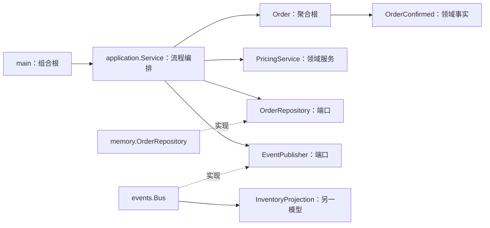
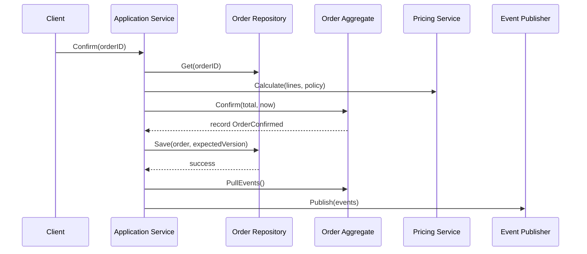

# 13. DDD 战术模式

> 阶段：③ 架构进阶 ｜ 难度：⭐⭐⭐⭐⭐ ｜ 预计耗时：3 天

本章用一个可运行的订购（Ordering）限界上下文，把实体、值对象、聚合根、领域服务、应用服务、仓储和领域事件串成一条完整业务链路。

## 🎯 学习目标

- 根据“身份”与“属性”区分实体和值对象。
- 让聚合根成为修改聚合内部状态的唯一入口。
- 用仓储接口隔离领域模型与持久化细节。
- 区分领域计算与应用流程编排。
- 在持久化成功后发布领域事件，实现跨聚合协作。

## 🗺️ 示例结构

```text
13-ddd-patterns/
├── domain/
│   ├── errors.go                 共享领域错误
│   ├── event.go                  领域事件契约
│   └── order/
│       ├── value_objects.go      Money、Address 值对象
│       ├── order.go              Order 聚合根、Line 实体
│       ├── pricing.go            PricingService 领域服务
│       └── event.go              OrderConfirmed 领域事件
├── application/
│   ├── ports.go                  仓储与事件发布端口
│   └── service.go                应用服务与用例编排
├── infrastructure/
│   ├── memory/                   内存仓储适配器
│   └── events/                   同步事件总线、库存投影
└── main.go                       组合根与完整示例
```

依赖始终由外向内：基础设施实现应用层需要的端口，领域层不知道仓储和事件总线的存在。



## 🧩 战术模式在代码中的落点

| 模式 | 本章类型 | 判断标准 |
|---|---|---|
| 值对象 | `Money`、`Address` | 无身份，按值比较，构造后不可变 |
| 实体 | `Line` | 在订单内部拥有稳定的 `LineID` |
| 聚合根 | `Order` | 管理 Line 的生命周期并保护整体不变式 |
| 仓储 | `application.OrderRepository` | 以完整聚合为读写单位，不暴露存储结构 |
| 领域服务 | `order.PricingService` | 承载不自然属于单个实体的定价规则 |
| 应用服务 | `application.Service` | 加载、调用领域行为、保存、发布事件 |
| 领域事件 | `order.OrderConfirmed` | 描述已经发生且不可变的领域事实 |

### 实体 vs 值对象

两个价格都是 `5000 CNY` 时，它们在业务上没有区别，因此 `Money` 按值相等。两条订单行即使商品和数量相同，只要 `LineID` 不同，仍是不同实体。

值对象字段不导出，构造函数一次性验证数据。`Add` 和 `Multiply` 返回新值，不修改原值；金额使用最小货币单位 `int64`，避免浮点误差。

### 聚合与不变式

调用方不能直接取得 `Order` 内部的行切片，只能通过 `AddLine`、`RemoveLine` 和 `Confirm` 修改。聚合根集中维护以下规则：

- 只有草稿订单可以增删行。
- 同一个订单中行 ID 和商品 ID 不可重复。
- 空订单不能确认，订单只能确认一次。
- 每次成功状态变更都会推进版本号。

`Lines()` 与 `Clone()` 返回防御性副本，防止调用方绕过行为方法修改聚合。

### 领域服务 vs 应用服务

`PricingService.Calculate` 只处理“订单行 + 折扣策略 → 总价”，不访问数据库、不发布事件，这是领域规则。

`application.Service.Confirm` 则负责流程顺序：



保存失败时不会发布事件。发布失败时订单已经确认，调用者会得到 `ErrEventPublish`；生产系统通常通过 transactional outbox 解决“数据库提交成功但消息发送失败”的一致性问题。

### 仓储与乐观并发

内存仓储使用互斥锁保证并发安全，并用 `expectedVersion` 检测陈旧写入。两位调用者读取相同版本后，只有第一个保存成功，第二个得到 `ErrOrderConflict`。仓储保存和返回的都是深拷贝，外部修改不会隐式改变持久化状态。

### 领域事件与跨聚合协作

`Order.Confirm` 只记录 `OrderConfirmed`，并不知道谁会处理它。应用服务保存订单后把事件交给 `events.Bus`，库存投影订阅该事件并记录预留数量。这样订单聚合不依赖库存模型，新的订阅者也不需要修改订单代码。

## ▶️ 运行与验证

在仓库根目录执行：

```bash
go run ./stage-3-architecture/13-ddd-patterns
go test ./stage-3-architecture/13-ddd-patterns/...
go test -race ./stage-3-architecture/13-ddd-patterns/...
```

示例输出：

```text
order=order-2026 status=confirmed total=10000 CNY inventory_reserved=2
```

建议按以下顺序阅读：`domain/order/value_objects.go` → `domain/order/order.go` → `domain/order/pricing.go` → `application/service.go` → `infrastructure/` → `main.go`。

## ⚖️ 示例边界

- 内存仓储不是生产持久化方案，进程退出后数据消失。
- 同步事件总线没有持久化、重试和死信队列；一个处理器失败会停止当前分发。
- 库存投影只演示跨模型协作，不处理真实库存不足、释放或补偿。
- 目录结构不是唯一答案；关键是聚合边界、不变式所有权和依赖方向。
- 本章不是事件溯源：领域事件用于通知，不用于重建聚合状态。

## 🧪 练习

见 [`EXERCISES.md`](./EXERCISES.md)。练习覆盖修改收货地址、阶梯折扣、幂等事件和 transactional outbox 设计。

## ✅ 自测清单

- [ ] 能用“身份是否重要”判断实体和值对象。
- [ ] 能解释为什么 `Order.Lines()` 返回副本。
- [ ] 能指出订单聚合保护的四类不变式。
- [ ] 能说明 `PricingService` 与 `application.Service` 的职责差异。
- [ ] 能解释仓储为什么以聚合而不是数据库表为单位。
- [ ] 能说明领域事件为什么要在保存成功后发布。
- [ ] 能描述同步事件发布失败时的风险及 outbox 解法。

## 🔗 前置依赖

- 第 12 章：整洁架构与依赖倒置

## 📚 推荐扩展阅读

- 《领域驱动设计：软件核心复杂性应对之道》Eric Evans
- 《实现领域驱动设计》Vaughn Vernon
- [DDD Lite in Go](https://threedots.tech/post/ddd-lite-in-go-introduction/)
