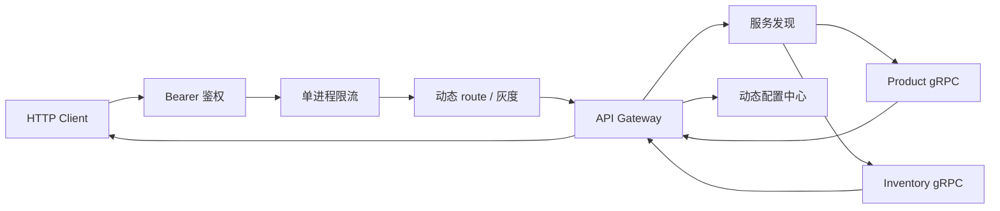
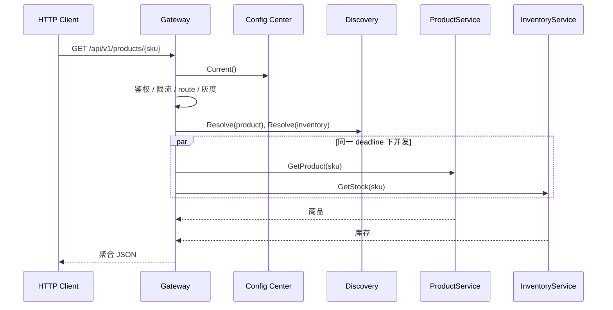

# 14. 微服务

> 阶段：③ 架构进阶 ｜ 难度：⭐⭐⭐⭐⭐ ｜ 预计耗时：4 天

## 🎯 学习目标

完成本章后，你将能够：

- 用 protobuf 先定义跨进程契约，再生成 Go/gRPC 代码；
- 区分并实现 unary、server-streaming 与 bidirectional-streaming RPC；
- 用服务发现注册、解析并监听真实网络实例；
- 用版本化动态配置控制超时、限流、路由开关和确定性灰度；
- 用 API Gateway 统一处理鉴权、限流、路由、服务解析、聚合与错误映射；
- 根据一致性、时延和解耦需求，在同步 gRPC 与异步 MQ 之间做选择；
- 明确组件的并发所有权、context 取消和关闭顺序。

## 📦 本章产出

本章提供一个可独立运行的“商品 + 库存”微服务切片：

- `ProductService.GetProduct`：unary RPC；
- `InventoryService.GetStock`：unary RPC；
- `InventoryService.WatchStock`：server-streaming RPC；
- `InventoryService.SyncStock`：bidirectional-streaming RPC；
- 并发安全的内存服务发现与动态配置适配器；
- 带 Bearer 鉴权、单进程限流、灰度和并发聚合的 HTTP Gateway；
- 真实 TCP/bufconn gRPC transport 测试、HTTP 集成测试与 race 测试；
- 一个会启动完整组件、请求 Gateway 并有序退出的可执行示例。

默认运行不需要 Docker、Consul、etcd、Nacos 或消息中间件。

## 🗺️ 目录结构

```text
14-microservices/
├── api/
│   ├── product/v1/       # product.proto 与生成的 Go/gRPC 代码
│   └── inventory/v1/     # inventory.proto 与生成的 Go/gRPC 代码
├── internal/
│   ├── product/          # 商品目录和 ProductService
│   ├── inventory/        # 库存状态、订阅和 InventoryService
│   ├── discovery/        # 服务发现合同与内存实现
│   ├── configcenter/     # 动态配置合同、灰度和内存实现
│   └── gateway/          # 鉴权、限流、连接、聚合和错误映射
├── app.go                # 组合根与生命周期
├── main.go               # 可执行入口
├── buf.yaml              # protobuf module
├── buf.gen.yaml          # 固定版本的 Go 生成插件
└── EXERCISES.md          # 进阶练习与验收标准
```

## 🏗️ 总体架构



服务发现中保存的是 `service + instance ID + host:port`，而不是 Go 对象。Gateway 必须经过 gRPC 连接调用两个服务，因此示例保留了序列化和网络边界。

## 🧾 契约优先与代码生成

手写来源只有：

- `api/product/v1/product.proto`
- `api/inventory/v1/inventory.proto`

生成的 `.pb.go` 与 `_grpc.pb.go` 会提交到仓库，让学习者不安装生成器也能直接运行。不要手工修改生成文件；改变协议后应重新生成。

本章采用的兼容性规则：

1. 已发布字段号不得复用或改变含义；
2. 新字段使用新编号，旧客户端会忽略未知字段；
3. 删除字段时应保留其编号和名称为 `reserved`；
4. 每个 RPC 使用独立、语义明确的 request/response 类型；
5. 包名包含版本号，例如 `product.v1`，破坏性变更进入新版本包。

生成器版本固定在 `buf.gen.yaml`。从仓库根目录执行：

```powershell
Push-Location stage-3-architecture/14-microservices
go run github.com/bufbuild/buf/cmd/buf@v1.65.0 lint
go run github.com/bufbuild/buf/cmd/buf@v1.65.0 generate
Pop-Location
```

Buf 通过 `go run ...@version` 启动本地 Go 插件，因此不依赖系统级 `protoc`，也不会把 Buf 变成应用运行时依赖。

## 🔁 三种 RPC 形态

| 形态 | 本章示例 | 适用场景 | 生命周期要点 |
|---|---|---|---|
| unary | `GetProduct`、`GetStock` | 一问一答、短事务查询 | deadline 必须覆盖一次调用 |
| server-streaming | `WatchStock` | 服务端持续推送状态变化 | 客户端取消后服务端循环必须退出 |
| bidirectional-streaming | `SyncStock` | 双方独立发送、逐条确认 | 正确处理 `Recv`、`Send`、EOF 和取消 |

库存服务内部的 `Watch` 使用容量为 1 的“最新快照”通道。慢订阅者不会阻塞库存写入；当变化速度超过消费速度时，过时快照会被更新快照替换。这是明确的状态流语义，不适合要求“每条事件都不能丢”的业务事件。

## 🔎 服务发现

`discovery.Registry` 公开四项能力：

- `Register`：注册实例并返回幂等注销函数；
- `Resolve`：按实例 ID 的稳定顺序解析一个地址；
- `Watch`：立即发送当前不可变快照，并继续发送最新快照；
- `Close`：关闭 watcher，随后拒绝新操作。

内存实现适合教学和确定性测试。真实 Consul/etcd 适配器还需要租约、心跳、健康状态、网络分区、重连、认证和一致性策略，不能把本章实现直接当成生产服务发现。

## ⚙️ 动态配置与灰度

Gateway 配置包含：

- `RouteEnabled`：路由总开关；
- `RequestTimeout`：聚合调用的统一 deadline；
- `RateLimit` / `RateWindow`：单进程 fixed-window 限流参数；
- `RolloutPercent`：0–100 的灰度比例；
- `BearerToken`：本章演示用的静态 token。

每次有效更新都产生单调递增版本；非法更新不会改变当前版本。灰度使用稳定 request key 的 FNV-1a hash 分桶，所以同一 key 在同一比例下结果稳定，0% 永不放行，100% 全部放行。

## 🌐 API Gateway 请求流程



成功响应示例：

```json
{"sku":"book-1","name":"Go Microservices","price_cents":9900,"quantity":10,"stock_version":1}
```

错误映射保持稳定且不泄露下游文本：

| gRPC / Gateway 状态 | HTTP |
|---|---:|
| `InvalidArgument` | 400 |
| `NotFound` / route 未开放 | 404 |
| `Unavailable` / discovery 无实例 | 503 |
| `DeadlineExceeded` | 504 |
| 未知内部错误 | 500 |

商品或库存任一下游失败时，Gateway 返回完整错误响应，不返回半份聚合数据。

## 📨 同步 gRPC 还是异步 MQ

| 问题 | 优先 gRPC | 优先 MQ |
|---|---|---|
| 调用者是否立即需要结果 | 是 | 否 |
| 是否需要天然削峰 | 弱 | 强 |
| 服务是否必须同时在线 | 通常是 | 可解耦 |
| 失败反馈 | 同步 status/deadline | 重试、死信、补偿 |
| 典型场景 | 查询、短命令、聚合 | 领域事件、批处理、跨系统通知 |

不要因为“微服务就必须异步”而引入 MQ，也不要用同步调用串起过长依赖链。先从业务是否需要立即结果、一致性边界和失败恢复策略出发。

## ▶️ 运行与验证

在仓库根目录执行：

```bash
go run ./stage-3-architecture/14-microservices
go test ./stage-3-architecture/14-microservices/... -count=1
go test -race -count=1 ./stage-3-architecture/14-microservices/...
```

全仓质量门：

```bash
go test ./... -count=1
go vet ./...
go test -race -count=1 ./...
go build ./...
golangci-lint run
openspec validate chapter-14-microservices --strict
```

## ⚖️ 示例边界

- discovery、config center 和 limiter 都是单进程教学适配器，不是生产级分布式实现；
- `X-Request-Key` 来自客户端，不能作为可信身份；当前 limiter 也不会淘汰长期不用的 key，生产系统应改用鉴权后的主体标识，并增加过期清理或分布式限流；
- Bearer token 仅演示 Gateway 策略位置，生产系统应使用标准身份协议与安全存储；
- gRPC 使用明文的本机连接，生产环境应补充 TLS/mTLS、证书轮换与服务身份；
- 示例没有持久化、健康检查、负载均衡、重试、熔断和可观测性；
- `WatchStock` 是最新状态流，不保证保存每次中间变化；
- 本章只比较 MQ 决策，不重复实现第 10 章的消息队列。

这些限制是后续第 15 章和 Capstone 3 的输入，不应通过在本章堆叠生产框架来掩盖。

## 🧪 练习

参见 [`EXERCISES.md`](./EXERCISES.md)。每个练习都提供约束、边界和可观察验收标准。

## ✅ 自测清单

- [ ] 能解释 `.proto`、生成代码与业务实现各自的所有权；
- [ ] 能通过测试指出 unary、server-streaming 和 bidi-streaming 的差异；
- [ ] 能解释服务发现为什么保存地址而不是 Go 对象；
- [ ] 能说明配置版本、latest-only 订阅和确定性灰度的语义；
- [ ] 能追踪 Gateway 在调用下游前执行的策略顺序；
- [ ] 能说明聚合请求为什么不返回部分成功；
- [ ] 能根据业务是否立即需要结果选择 gRPC 或 MQ；
- [ ] 能指出本章内存适配器距离生产系统还缺哪些可靠性能力。

## 🔗 前置依赖

- 第 13 章：DDD 战术模式、边界与领域事件

## 📚 推荐扩展阅读

- [gRPC-Go](https://github.com/grpc/grpc-go)
- [Protocol Buffers 官方文档](https://protobuf.dev/)
- [Buf 文档](https://buf.build/docs/)
- 《微服务架构设计模式》Chris Richardson
