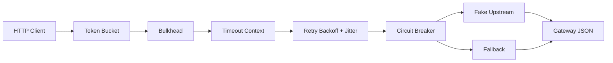

# 15. 韧性与性能

> 阶段：③ 架构进阶 ｜ 难度：⭐⭐⭐⭐⭐ ｜ 预计耗时：3 天

本章承接第 14 章的商品/库存微服务概念，演示服务从“能跑”走向“扛得住”：限流、隔离、重试、熔断、降级、超时和性能剖析。

## 🎯 学习目标

完成本章后，你将能够：

- 用 token bucket 在进入下游前拒绝突发流量；
- 用 bulkhead 限制并发，避免一个慢依赖拖垮整个进程；
- 写出带指数退避和 jitter 的重试，并说明哪些错误不应重试；
- 用 `gobreaker` 封装 circuit breaker，理解 closed / open / half-open 状态；
- 设计显式降级响应，避免调用方误把降级数据当作完整真实数据；
- 注册并使用 `net/http/pprof` 分析 CPU / heap 热点；
- 用 vegeta / wrk / hey 等工具压测接口并解读吞吐、延迟和错误率。

## 📦 本章产出

本章提供一个自包含的“商品详情韧性 Gateway”教学切片：

- 可脚本化的 fake upstream，支持成功、慢响应、临时失败和持续失败；
- 教学版 token bucket limiter；
- semaphore bulkhead；
- 指数退避 + jitter retry；
- `github.com/sony/gobreaker/v2` 熔断封装；
- Gateway 稳定错误映射和 fallback JSON；
- pprof 注册和 heap workload 示例；
- 默认无需外部服务的单元测试、race 测试和可运行 demo。

## 🗺️ 目录结构

```text
15-resilience-perf/
├── internal/
│   ├── upstream/      # 可控假上游和 HTTP client
│   ├── limiter/       # 教学版 token bucket
│   ├── bulkhead/      # 并发隔离
│   ├── retry/         # 指数退避、jitter、context 取消
│   ├── breaker/       # gobreaker/v2 封装
│   ├── gateway/       # HTTP handler 和策略编排
│   └── profiler/      # pprof 注册和热点 workload
├── app.go             # demo 组合根
├── main.go            # 可执行入口
└── EXERCISES.md       # 进阶练习与验收标准
```

## 🧭 请求流程



策略顺序很重要：先用本地限流拒绝明显过载，再用 bulkhead 控制并发；进入下游调用后，所有重试都受同一个 timeout context 约束；每次真实调用都经过 circuit breaker；最终才决定成功、降级或失败。

## ⚙️ 教学实现 vs 生产方案

本章手写 token bucket、retry 和 bulkhead 是为了锻炼机制理解、测试和策略编排。生产系统通常优先复用成熟库、网关、服务网格和平台能力。

| 主题 | 本章教学实现 | 生产常见选择 |
|---|---|---|
| 本地限流 | 手写 token bucket | `golang.org/x/time/rate`、Envoy local rate limit、Nginx/OpenResty、APISIX/Kong 插件 |
| 分布式限流 | 练习设计 | Redis + Lua/GCRA、Envoy global rate limit、Sentinel、API Gateway 平台能力 |
| 熔断 | `gobreaker/v2` 封装 | `sony/gobreaker`、failsafe-go、Sentinel、Envoy outlier detection、Service Mesh |
| 重试/退避 | 手写 retry/backoff | `hashicorp/go-retryablehttp`、`cenkalti/backoff`、gRPC retry policy、Envoy retry policy |
| 隔离 | semaphore bulkhead | worker pool、连接池隔离、服务网格/网关级并发限制、舱壁化部署 |
| 降级 | 静态 fallback | 缓存、只读副本、功能开关、灰度配置、SLO/error-budget 驱动策略 |
| 性能分析 | pprof 示例 | pprof、go tool trace、Prometheus/Grafana、Pyroscope、Parca、Datadog/New Relic |
| 压测 | 文档命令 | vegeta、wrk、hey、k6、JMeter、影子流量/回放平台 |
| 服务治理 | 代码内编排 | Envoy、Kong、APISIX、Istio、Linkerd、Consul Connect、平台网关 |

生产化还要补齐多租户配额、身份维度、配置热更新、指标告警、策略治理、灰度发布、容量评估、故障演练、回滚策略和 pprof 暴露鉴权。

## ▶️ 运行与验证

在仓库根目录执行：

```bash
go run ./stage-3-architecture/15-resilience-perf
go test ./stage-3-architecture/15-resilience-perf/... -count=1
go test -race -count=1 ./stage-3-architecture/15-resilience-perf/...
```

全仓质量门：

```bash
gofmt -w stage-3-architecture/15-resilience-perf
go test ./... -count=1
go vet ./...
go build ./...
golangci-lint run
openspec validate chapter-15-resilience-perf --strict
```

`golangci-lint` 和 `openspec` 如果本机未安装，应如实记录未运行原因。

## 🔬 pprof 操作示例

本章 demo 的 `RunDemo` 使用 `httptest` 随机端口并会在演示请求结束后退出；它用于自动化验证 pprof handler 已注册。下面命令适用于你在练习或实验中把同一组 handler 挂到一个长期运行的本地 HTTP server 后执行。将 `<addr>` 替换为实际监听地址，例如 `127.0.0.1:8080`。

常见命令：

```bash
go test -run TestAllocateHotHeap -bench . ./stage-3-architecture/15-resilience-perf/internal/profiler
go tool pprof http://<addr>/debug/pprof/heap
go tool pprof 'http://<addr>/debug/pprof/profile?seconds=30'
```

## 📈 压测命令示例

这些命令需要本机安装对应工具，并且需要你先启动一个长期运行的本地 HTTP server，不属于默认测试路径：

```bash
vegeta attack -duration=30s -rate=100/s http://<addr>/api/v1/products/book-1 | vegeta report
wrk -t4 -c64 -d30s http://<addr>/api/v1/products/book-1
hey -z 30s -q 100 http://<addr>/api/v1/products/book-1
```

观察重点不是单个 QPS 数字，而是：p50/p95/p99 延迟、错误率、限流比例、熔断打开时间、降级比例和资源曲线是否符合预期。

## ⚖️ 示例边界

- 本章 limiter 是单进程教学实现，不支持多实例全局配额；
- fake upstream 只用于确定性测试，不代表真实依赖的全部故障模式；
- retry 不会让不可重试错误变成功，错误分类比重试次数更重要；
- fallback 必须显式标记 `degraded`，不能悄悄返回伪装成真实的数据；
- pprof 和压测都可能增加服务负载，生产使用必须有安全边界。

## 🧪 练习

见 [`EXERCISES.md`](./EXERCISES.md)。

## ✅ 自测清单

- [ ] 能解释 token bucket 的容量、补充速率和 `Retry-After` 关系。
- [ ] 能说明 bulkhead 与限流解决的问题有什么不同。
- [ ] 能判断哪些错误应该重试，哪些错误不该重试。
- [ ] 能画出 circuit breaker 的 closed / open / half-open 状态转换。
- [ ] 能设计一个显式降级响应，并说明调用方如何识别它。
- [ ] 能用 pprof 找到一个 heap 或 CPU 热点。
- [ ] 能读懂压测报告中的 p95/p99、错误率和吞吐变化。

## 🔗 前置依赖

- 第 14 章：微服务基础设施

## 📚 推荐扩展阅读

- Netflix Hystrix 论文
- [`sony/gobreaker`](https://github.com/sony/gobreaker)
- [Go pprof tutorial](https://go.dev/blog/pprof)
- [Envoy outlier detection](https://www.envoyproxy.io/docs/envoy/latest/intro/arch_overview/upstream/outlier)
- 《数据密集型应用系统设计》Martin Kleppmann
