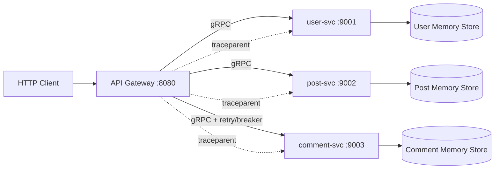

# 🚩 Capstone 3：微服务版博客

> 阶段：③ 架构进阶 · 阶段综合项目 ｜ 难度：⭐⭐⭐⭐⭐ ｜ 预计耗时：7 天

本项目把博客拆成三个限界上下文，通过 gRPC 协作，并由 HTTP Gateway 聚合。默认实现使用独立内存仓储，让测试无需数据库、注册中心或 Docker；容器化配置用于体验真实的多进程拓扑。

## 🎯 项目目标

- `user-svc`：注册、登录、HMAC token 验证、用户查询；
- `post-svc`：文章 CRUD、标签过滤、分页和作者所有权；
- `comment-svc`：嵌套评论、评论树和软删除；
- `gateway`：JSON/HTTP API、鉴权、聚合、限流、超时、重试、熔断和降级；
- W3C `traceparent` 兼容的端到端 trace 传播与结构化 span；
- Dockerfile + Docker Compose 多进程运行环境。

## 🧩 综合应用的章节

- **12 Clean Architecture**：每个服务把 transport、应用逻辑、数据所有权和组合根分离；
- **13 DDD Patterns**：用户、文章、评论是三个 bounded context，只通过 ID 和合同通信；
- **14 Microservices**：protobuf/gRPC、HTTP Gateway、独立进程和容器网络；
- **15 Resilience & Performance**：token bucket、总超时、有限重试、circuit breaker、显式降级。

## 🗺️ 架构



每个服务独占自己的数据。Gateway 创建评论前会同步确认文章存在；文章详情先读取文章和作者，再调用评论服务。评论属于可选聚合数据：评论服务失败时仍返回文章主体，并设置 `comments_degraded: true`。

## 📁 目录

```text
capstone-3-blog-ms/
├── api/blog/v1/          # proto 与生成代码
├── cmd/                  # 四个独立二进制
├── internal/
│   ├── users/            # user bounded context
│   ├── posts/            # post bounded context
│   ├── comments/         # comment bounded context
│   ├── gateway/          # HTTP API 与聚合
│   ├── resilience/       # limiter / retry / breaker
│   ├── tracekit/         # 教学版 trace context 与 exporter
│   └── runtime/          # graceful shutdown
├── e2e_test.go           # 真实 gRPC 序列化 + HTTP 冒烟流
├── Dockerfile
├── docker-compose.yml
└── EXERCISES.md
```

## ▶️ 本地运行

分别打开终端：

```bash
go run ./stage-3-architecture/capstone-3-blog-ms/cmd/user-svc
go run ./stage-3-architecture/capstone-3-blog-ms/cmd/post-svc
go run ./stage-3-architecture/capstone-3-blog-ms/cmd/comment-svc
go run ./stage-3-architecture/capstone-3-blog-ms/cmd/gateway
```

注册并创建文章：

```bash
curl -sS -X POST localhost:8080/api/register \
  -H 'content-type: application/json' \
  -d '{"username":"alice","password":"secret1"}'

curl -sS -X POST localhost:8080/api/posts \
  -H 'content-type: application/json' \
  -H 'authorization: Bearer <token>' \
  -d '{"title":"Go 微服务","body":"边界与治理","tags":["go","ddd"]}'
```

也可以运行：

```bash
docker compose -f stage-3-architecture/capstone-3-blog-ms/docker-compose.yml up --build
```

## 🧪 验证

```bash
go test ./stage-3-architecture/capstone-3-blog-ms/... -count=1
go test -race ./stage-3-architecture/capstone-3-blog-ms/... -count=1
go vet ./stage-3-architecture/capstone-3-blog-ms/...
```

`e2e_test.go` 使用 `bufconn` 启动三个真实 gRPC server，再通过 `httptest` 请求真实 Gateway，覆盖注册、token、文章、嵌套评论、聚合详情和跨服务 trace。

## 🔭 Trace 边界

`tracekit` 用于教学：它生成和解析 W3C `traceparent`，通过 gRPC metadata 传播，并在测试中把 span 导出到内存。它不是完整 OpenTelemetry SDK，也不会把 Compose 流量发送到外部后端。生产演进应替换为 OTel SDK + Collector/Jaeger，并补充采样、资源属性、metrics/log correlation、批量导出和鉴权。

## ⚖️ 架构与 CAP 取舍

- **服务边界**：按业务能力拆分，而不是按表拆分；三个服务不共享仓储。
- **一致性**：文章与评论不使用分布式事务。Gateway 的同步存在性校验只能缩小悬空引用窗口，生产系统可用 outbox/event + 补偿进一步治理。
- **可用性**：文章详情把文章主体视为核心，把评论视为可降级信息；依赖失败时优先保住主体读取。
- **分区容忍**：跨服务网络错误不可避免，因此必须有超时和清晰失败语义，不能无限等待或无限重试。
- **教学简化**：内存仓储保证默认测试自包含，但不提供持久化、水平扩展或实例间一致性。

## ✅ 完成标准

- [x] 三个服务可独立启动、独立测试；
- [x] Gateway 聚合端到端冒烟测试通过；
- [x] trace context 跨 Gateway 和三个 gRPC 服务传播；
- [x] 限流、超时、重试、熔断和显式评论降级就位；
- [x] Dockerfile 与 Docker Compose 就位；
- [x] 代码可运行、有测试、有 README 说明；
- [x] 能讲清楚拆服务依据、bounded context 边界和 CAP 取舍。

## 🧪 练习

见 [`EXERCISES.md`](./EXERCISES.md)。
